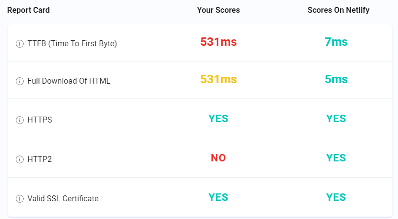
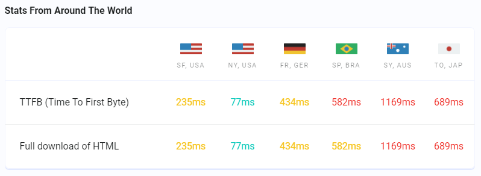
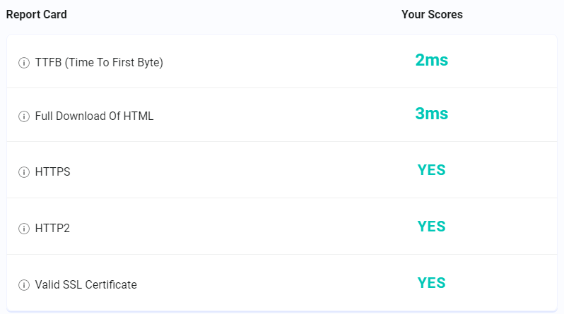
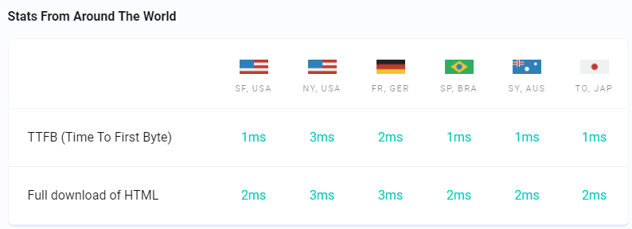
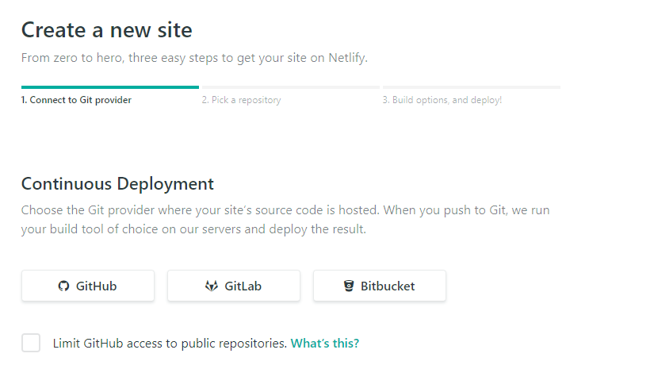
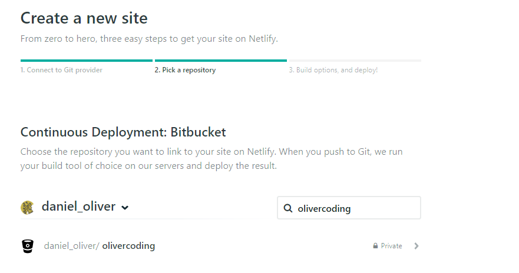
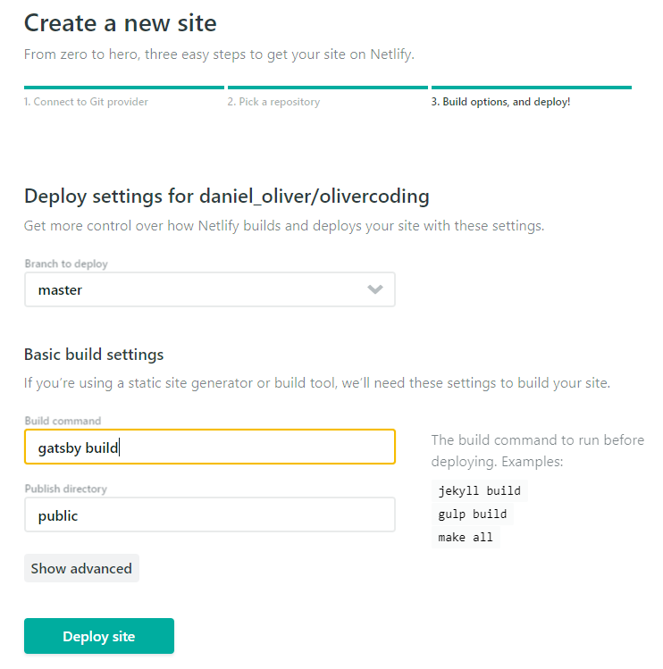
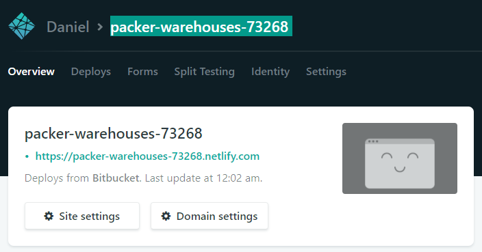
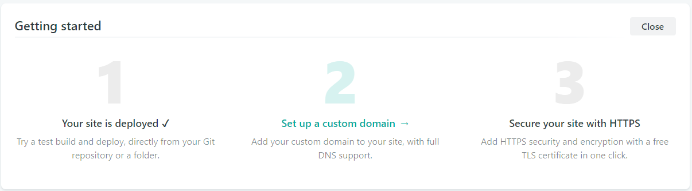

## Netlify simplifies server setup

[Netlify][0] is a fantastic site to handle _"Global CDN, Continuous Deployment, one click HTTPS and more…"_ 

The reason this is fantastic to me is that beforehand I was trying to manage this by hand on a server on Linode with a sketchy self-written, self-updating deployment and management process. 

For example, my blog used this nginx configuration below and I have no idea if it is completely right or not, but I don't need to care now since Netlify is taking care of it for me.
```
server {
    listen 80;
    listen [::]:80;
    server_name olivercoding.com www.olivercoding.com;
    return 301 https://$server_name$request_uri;
}
server {
    listen 443;
    server_name olivercoding.com www.olivercoding.com;
    ssl on;
    ssl_certificate /etc/letsencrypt/live/olivercoding.com/fullchain.pem;
    ssl_certificate_key /etc/letsencrypt/live/olivercoding.com/privkey.pem;
    ssl_trusted_certificate /etc/letsencrypt/live/olivercoding.com/fullchain.pem;
    ssl_protocols TLSv1 TLSv1.1 TLSv1.2;
    ssl_session_cache shared:SSL:10m;
    ssl_session_timeout 10m;

    root /var/www/olivercoding.com/public_html;
    index index.html;
    location / {
        try_files $uri $uri/index.html index.html;
    }
}
```

<br/>

## Netlify rocks that Global CDN

Netlify has this website called [testmysite.io][1] that measures a few interesting stats. Now since it's run by Netlify I have some skepticism since it is trying to sell Netlify's product, but in this case it's not actually wrong. 

**Diclaimer**: The only thing I'm proving here is that I'm not more experienced to do better than Netlify and that I'm not willing to dedicate enough time to learn to do it better.

### Old site on Linode with NGinx





### New site on Netlify





There are some other nice benefits to Netlify, but the gist is: it works for me.

<br/>

# Deployment Steps

1. Sign Up for Netlify. Either choose the traditional email, or you could link it to your favorite online source control.


2. Click "New site from Git"



3. Choose your favorite online source control, which will then prompt to log in (or public only) and choose a repository



4. Netlify found GatsbyJS, the only thing in that repository, and automatically suggests some basic settings. Very smooth.  If you're considering other static site generators, then don't forget that Netlify also maintains [this list of static site generators][2].



5. Check that the build works. Perhaps push something to master to ensure that it's picked up and built and then deployed.



6. For bonus points, set up your custom domain (netlify defaults to a random phrase to start with) and HTTPS. I'm not going to go over that here 



## Summary

Netlify has made GatsbyJS a smooth and easy deployment, automatically taking care of details I don't want to.

[0]: https://www.netlify.com/
[1]: https://testmysite.io/
[2]: https://www.staticgen.com/
