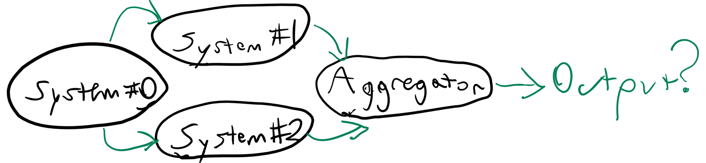

**Functional programming has an oft-repeated benefit: deterministic output.** A function will **always** return the same output, if given the same input.

Now this may seem obvious, a computer is conceptually nothing more than an elaborate mathematical model. Why shouldn't it return anything different?

Let's start with a simple example, a function _x_ that when given _y_, returns _y + 2_.
```fsharp
let x y = y + 2
```
There are no side-effects in this function. It will return the exact same output, given the same inputs, no matter what the surrounding application's state may be.

Now let's take an immensely larger abstract example of four systems.


_System #0_ is the start of some elaborate distributed process.
_System #1_ and _System #2_ do some steps in parallel in this process. Then the results of _System #1_ and _System #2_ are aggregated by an _Aggregator_.

As shown right now, there is no guarantee of an order of events and the output of the aggregator may be in any order, whether it is **System #1 finishes all tasks first**
```
System #1 done Task #000
System #1 done Task #001
System #1 done Task #002
System #2 done Task #000
System #2 done Task #001
System #2 done Task #002
```
**System #2 finishes all tasks first**
```
System #2 done Task #000
System #2 done Task #001
System #2 done Task #002
System #1 done Task #000
System #1 done Task #001
System #1 done Task #002
```
**Or tasks are interleaved**
```
System #1 done Task #000
System #2 done Task #000
System #1 done Task #001
System #2 done Task #001
System #1 done Task #002
System #2 done Task #002
```
This is fine, and ideally, no matter what order the tasks are done, the final state will be the same for all three scenarios above.

But what if both _System #1_ and _System #2_ share a resource? 

This resource could be something like the company's General Ledger or maybe your bank account.  The order of debits and credits matter greatly and so the usage of these resources should be as determinstic as possible; however, not every application in the company depends on that resource, so those other applications may run in parallel.

<br>

## Determinism in Games

Many games have some randomness, often called the [Random Number Generator][0]. This adds some chaos to the mix. Interestingly, the vast majority of "randomness" in the computer is actually pseudo-random. 

For example, the [C# Random][1] class is described as this
> _Represents a pseudo-random number generator, which is a device that produces a sequence of numbers that meet certain statistical requirements for randomness._

The Random class may return the same results given [the same Seed value][3].
> _Providing an identical seed value to different Random objects causes each instance to produce identical sequences of random numbers. This is often done when testing apps that rely on random number generators._

[Deterministic pseudo-random number generators][2] are the way to go for games. Given the same starting seed, I can recreate every random event in the game while having some statistical guarantees of number distribution.

**The Pseudo-Random Number Generator (RNG) is my game's protected resource.** Every number must be requested in exactly the same order to reproduce the exact same result. 

Requesting a number from a RNG has side-effects: every request updates the RNG's internal state.

I'm using the [Mersenne Twister algorithm][4] from the [Math.NET Numerics][5] library for simplicity.  The algorithm has demonstratable flaws, but it's good enough for right now.

<br/>

## Summary

By using the same seed for the Random Number Generator, and also given the same player input, I'd expect the exact same things to happen every time I play my game. 

The benefits I get from this is that I can reproduce bug reports with ease. I can verify a player's score on the leaderboards by using their starting seed and inputs, to compute all the turns and see if the end-result matches what they claim it does. I can replay a game with minimal data. If one player has thirty spectators, the only thing I need send them is the starting seed and the player's input and they can reproduce the exact same playthrough without heavy network traffic.

**This has removed one more side-effect from my game and made my entire game a function.**

[0]: https://en.wikipedia.org/wiki/Random_number_generation
[1]: https://msdn.microsoft.com/en-us/library/ctssatww(v=vs.110).aspx
[2]: http://www.pcg-random.org/
[3]: https://msdn.microsoft.com/en-us/library/ctssatww(v=vs.110).aspx
[4]: https://en.wikipedia.org/wiki/Mersenne_Twister
[5]: https://numerics.mathdotnet.com/Random.html

