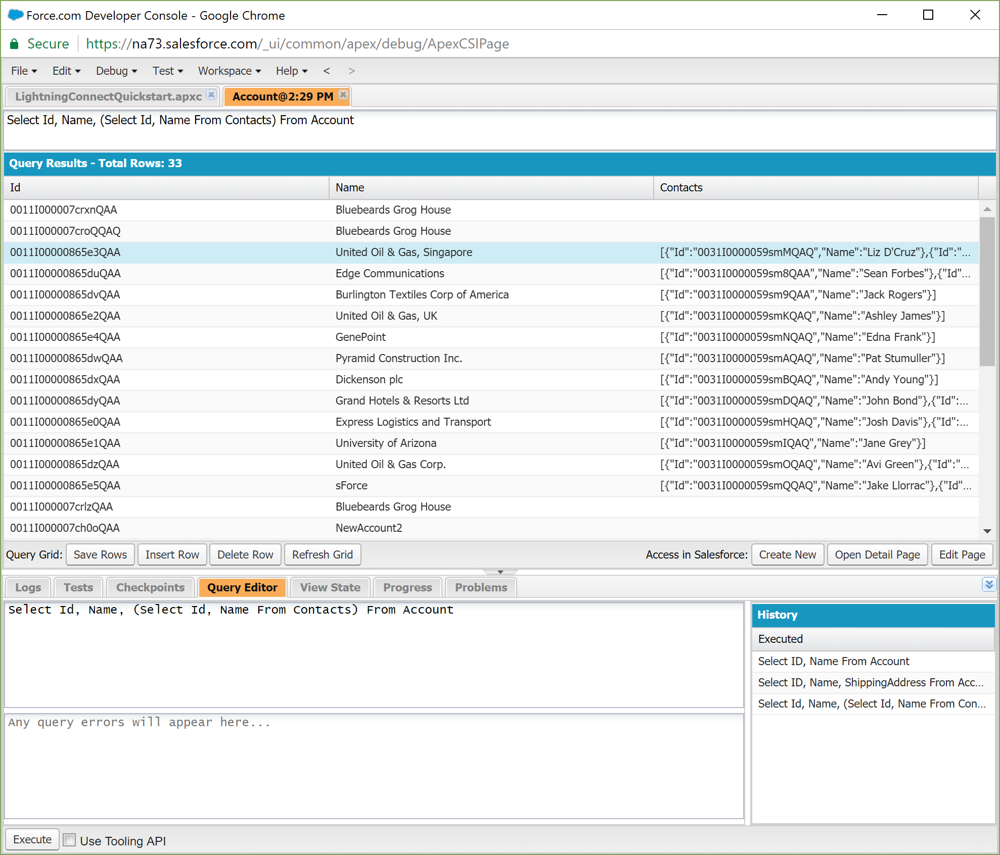

Salesforce is a Customer Relationship Management (CRM) system built on the Salesforce platform. In addition to the Salesforce offerings, the Salesforce platform also has a multitude of 3rd party apps and integrations, and bills itself as a way to [_Sell, service, market, and build apps on a single platform._][0]

## Trailhead

Salesforce Trailhead is [_The fun way to learn Salesforce_][1] and it's actually true. Trailhead is the Salesforce public training platform covering all sorts of topics, including Process Automation, Privacy Laws, Administration, and Integration. 


In addition to training, their marketing team is on point with their artwork and sense of wit. While that's not a feature sufficient to make a training platform worthy on it's own, it certainly keeps Trailhead from feeling dry and boring which itself reduces learning fatigue.

Trailhead is broken up into four main sections, Trails, Modules, Projects, and Superbadges. Trailmixes are a fifth item that are custom playlists combining the four main sections in different combinations and orders.

Modules take about a hour each and is information about a specific topic, with a quiz at the end or some coursework to test what you've learned. The coursework is to be completed in a Salesforce instance of a developer sandbox, which has automatic tests to determine if you've correctly done the coursework or not. 


Trails are a series of modules ordered to teach a bigger topic, such as "Admin Beginner" or "Developer Advanced".

Projects are a way to jump into the deep-end of the pool and just go straight to building things. If you learn by doing, skip the rest of the stuff and go to this.

Superbadges are advanced projects and are unlocked by completing pre-requisite modules. Completing these are nice badges on your profile, and are actually a course to [some Salesforce Certifications][2].

At the end of the day, most everything you do on Trailhead gets thrown onto your Trailhead profile to show off.


## Salesforce Developer Console

The Salesforce Developer Console is a web IDE baked into the platform to write code, run tests, run queries, and view logs. The picture below is a query with one of the training modules in Trailhead, note Bluebeards Grog House. 



The developer console is more appropriate for impromptu examination and lightweight tasks than any heavy development efforts; however, it's a fantastic pair with trailhead for just jumping into the code without downloading anything.

## Apex Language

Instead of using an existing language with a lot of support, libraries, and even users, Salesforce went their own path with a new language.

> _Apex is a strongly typed, object-oriented programming language that allows developers to execute flow and transaction control statements on the Force.com platform server in conjunction with calls to the Force.com​ API. Using syntax that looks like Java and acts like database stored procedures, Apex enables developers to add business logic to most system events, including button clicks, related record updates, and Visualforce pages. Apex code can be initiated by Web service requests and from triggers on objects._

Creating a new proprietary language to developer on your platform strikes me as a bold move, it's not always turned out well for adoption. Apex definitely has its problems like any other language but it's specially crafted for the Salesforce platform and it's good at what it does.

Database operations, database triggers, transforming data, and just general data operations are where I think Apex shines. Testing is a nice thing that is made easy with a lot of the test infrastructure that just works with nothing to setup. Mocking inbound calls, outbound calls, asynchronous code, and test setup is very easy.

The code below runs at scheduled intervals. Taking the top 200 rows of Leads with a blank LeadSource, and updating their LeadSource to "DreamForce" and then committing all 200 updates. The two database accesses is the SOQL (Salesforce SQL) statement inline, and then an "update" on the entire list at the end. This code even has 100% code coverage from tests.


## Salesforce Platform

Most businesses have at least one Excel spreadsheet as a disproporionately large source of the business's decision making. 

If the person who creates those insanely complicated Excel spreadsheets learned software development and then started a business, they'd create something that looks like Salesforce. Salesforce is a database with a GUI written by someone who loves Excel spreadsheets and that's a good thing.

Data access is easy as pie. Reacting to events such as a record update is easy, example below. Integrations with other systems is not only supported, but expcted. Workflows keep the processes flowing smoothly. Convention vs. configuration seems fairly well balanced so far, but we'll see as I go further. 

```apex
trigger ProjectTrigger on Project__c (after update) {
    for( Id projectNew : Trigger.newMap.keySet() )
    {
          if( Trigger.oldMap.get( projectNew ).Status__c != Trigger.newMap.get( projectNew ).Status__c 
             && 'Billable' == Trigger.newMap.get( projectNew ).Status__c )
          {
              BillingCalloutService.callBillingService(projectNew);
          }
    }
}
```

<br>

## Dislikes

All the "it just works" in Salesforce is limited by the [Execution Governors and Limits][3]. This is necessary to minimize bad practices and keep everything running smoothly for everyone. Tests aren't going to catch potential violations of these rules, so I fear that hitting them in production might be inevitable occassionally.

I understand the use case for Apex, for SOQL, and the other customized languages I haven't mentioned, but it's another hill on the learning curve.

## Summary

I've just begun earning badges on Trailhead, so I'm still very new with little knowledge yet I'm already liking the Salesforce platform. Salesforce has a lot of things going for it from the developer experience, not the least of which is the training platform. Salesforce "just works".

[0]: https://www.salesforce.com/products/what-is-salesforce/
[1]: https://trailhead.salesforce.com/en/home
[2]: http://certification.salesforce.com/platformdeveloperII
[3]: https://developer.salesforce.com/docs/atlas.en-us.apexcode.meta/apexcode/apex_gov_limits.htm
