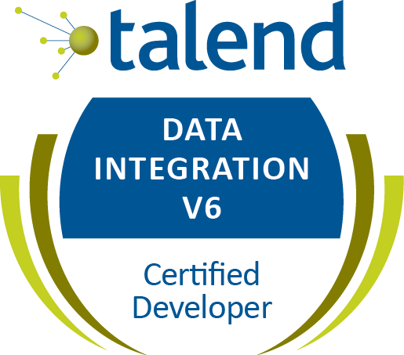

I have changed jobs, cities, and my attitude this year. I'm focusing on my professional year in review here.

## The New Job

A few months ago, I moved from Nashville, TN to Knoxville, TN.

This job change and city change was really rough as I was driving back and forth from Nashville to Knoxville very frequently. I know that many people drive long distances (more than a 100 miles) constantly, but I just can't do that with ease and the drive took a toll on me for the month or two I was doing that.

I made a lot of mistakes in not understanding the Knoxville market, in interviewing poorly, in not understanding how to job search well, and just trying to do too much. By trying to do too much, I wasn't giving each task the time required to do it well.

In the end, I took a favorable contract at [Radio Systems Corporation][0]. A lot of good people are here, and it's a nice place to work.

## The Old Job

With every change, people and places are left behind. I was sad to leave Nashville and my old job at [CareHere][1]. I had stayed there a little over 2 years, and the IT department when I left was nothing like it was when I arrived. I hope I left it a better place than I found it.

At CareHere, I was the longest remaining software developer with the most domain and business knowledge, and I was essentially a [Brent: a character from the Phoenix Project book.][2].

> Brent is a character in The Phoenix Project, who seems to be essential for every project and is badly overcommitted - he represents a human bottleneck.

I had my hand in most software projects, for better or for worse, and I spent most of my days fixing things, fire-fighting production issues, negotiating interfaces with clients and vendors, and trying to get new features out with minimal breakage. I was the model picture of the before in the [Phoenix Project][3] and [DevOps Handbook][4].

Since leaving CareHere, I've learned a lot and most of it from [Jamie Phillips][5] and I wish I knew then what I know now, back when I was at CareHere.

CareHere is a fantastic place with some fantastic people and I know they're rocking'n'rolling and doing amazing stuff. I'm sad to end that chapter of my life. But I'm also excited at this new chapter.

## Certifications

Certifications in IT are a wierd beast. IT is a great field in that certificates and degrees are not required at all if competence in an area can be shown separately; however, having a piece of paper certifying knowledge in something does help. To this goal, I've started down the path of gettings certifications "because I can".

My first certification was in something rather obscure: [Talend][6]. I had gained this knowledge at Radio Systems Corporation, so I went and took the certification exam and found it easy.

I'm working on several other certifications and I'll make a post on each of them as I gain them.

## Knowledge

I've gained a lot of purely technical knowledge this year in addition to the non-technical skills I'm trying my best to pick up.

Here's some of the new subject material that I've learned this year:

* [Salesforce][7], in preparation for an upcoming project.
* [Talend][6], including Data Integration and Administration.
* Java, to some small extent. I'm learning enough for each task as needed, but I'm not terribly confident in this.
* [Fitbit API][8]. I really liked this work project, very interesting.
* [GatsbyJS][9]. This is a Javascript React Framework, which [I made a plugin for][10]. This website is made in GatsbyJS.
* [Cake][11], a C# Build Automation Framework, which [I also made a plugin for][12].
* [My first Nuget package][12].
* [My first NPM package][10].
* F# language has still been in my projects, I'll have more to report in a few months.
* Azure is a massive topic, but I've started using it at work and I'm learning.
* [Ansible][13]. This is what I've been using to configure VMs I use at work.
* [CentOS][16]. In the past, I typically stayed with a Debian variant, but having to use CentOS has been quite educational.

Here's some of the subject material that I have improved significantly upon this year:

* C#. I've primarily been in .NET the past 3.5 years and I'm continuously learning new things here. This year, my biggest progress this year was in learning how to better unit test code. The more confident I am in my code, the more productive I am.
* REST API. A significant part of the first half of this year was writing APIs for many areas of CareHere.
* SQL Server. I've spent a lot of time in SQL Server optimizing slow queries and refactoring.
* Healthcare Domain Knowledge. Domain knowledge is as important as technical knowledge.

## Speaking

This year, I talked for 20 minutes at the Nashville .NET users group on F#. The slides are [here][14].

Next year, I want to speak more at conferences and user groups. I've submitted two talks to Codestock, and I'll be at [Functional Knoxville in February][15]. I'm not sure what other meetups and conferences I'll be at, but I hope to have a few more.

## Conferences

I love conferences. This year I went to Codestock in Knoxville and Music City Code in Nashville. Both excellent events and well worth going to again. I've been to Music City Code every year since it started, and it's growing admirably.

## Attitude

Each year, I should be able to look back and say "what in the world was I thinking?" Not because I was being an idiot, but because I've learned so much. If I've learned so much that I can consider my past self ignorant, that's a sign of progress.

I cannot say I know a lot or am perfect, but if I can say that I'm better today than I was yesterday, than I know that I've learned something. I can hope to continuously improve.

## Upcoming Year

This upcoming year is going to be awesome!

## Summary

I've made a lot of changes. I've learned a lot. I hope to improve a lot. So long 2017, hello 2018!

[0]: https://www.radiosystemscorporation.com/
[1]: https://carehere.com/
[2]: http://devopsdictionary.com/wiki/Brent
[3]: https://www.amazon.com/dp/B00AZRBLHO/
[4]: https://www.amazon.com/DevOps-Handbook-World-Class-Reliability-Organizations-ebook/dp/B01M9ASFQ3
[5]: https://www.phillipsj.net/
[6]: https://www.talend.com/
[7]: https://trailhead.salesforce.com/en/me/danieloliver
[8]: https://dev.fitbit.com/
[9]: https://www.gatsbyjs.org/
[10]: https://www.npmjs.com/package/gatsby-source-goodreads
[11]: https://cakebuild.net/
[12]: https://www.nuget.org/packages/Cake.Talend/
[13]: https://www.ansible.com/
[14]: https://danieloliver.github.io/talks/5minutefsharp/
[15]: https://www.meetup.com/FunctionalKnox/events/245653711/
[16]: https://www.centos.org/
