**Required: Azure Subscription** (I use free credits from [Visual Studio Dev Essentials][0])

**Required: .NET Core 2.0 or higher**

The start of any cloud services usually requires some money or a generous free trial. I have an existing Visual Studio Dev Essentials Subscription I will be using with Azure.

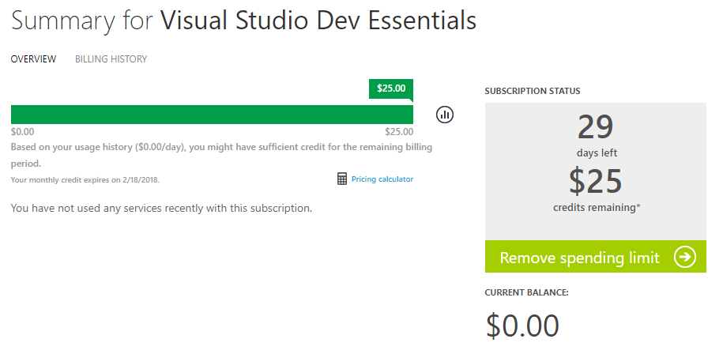

## Directory

I have an outlook email address with my Azure subscription. When I log into [Azure Portal][1], I am greeted with no resouces to display and the top right says "DEFAULT DIRECTORY"

```
Name: Daniel O
Email: efcdeo@outlook.com
Directory: efcdeooutlook (Default Directory) (REDACTED_GUID)
Domain: efcdeooutlook.onmicrosoft.com
```

Now on the left menu, select Azure Active Directory.

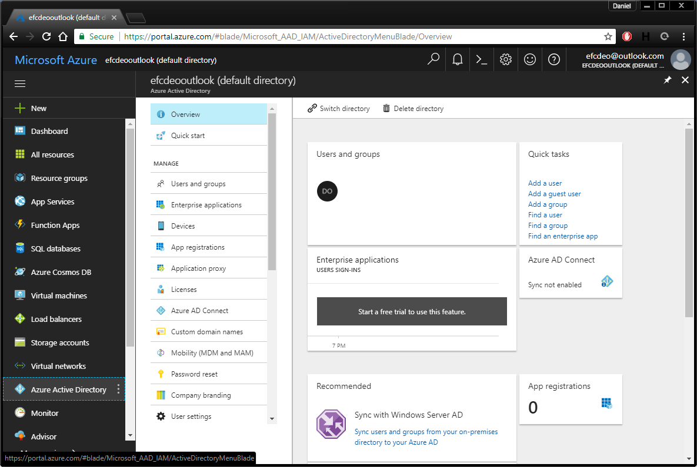

Since this is a new Azure AD you won't see much of anything here besides your default login. 

Now select **App Registrations**.

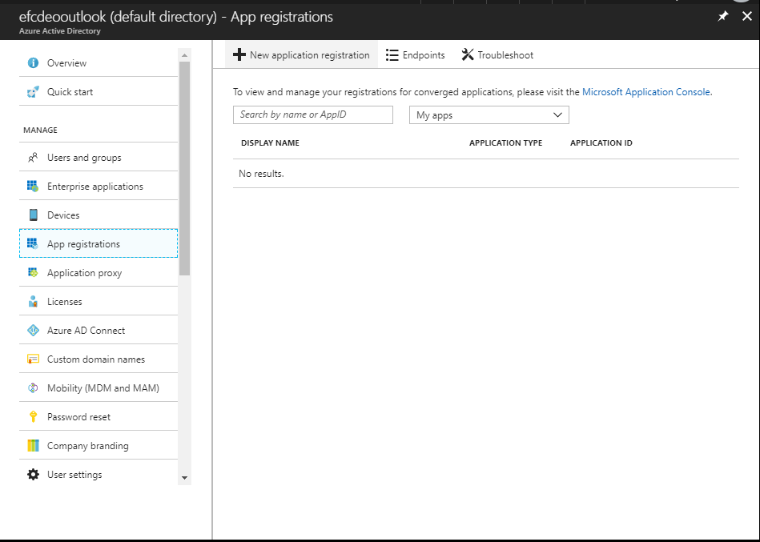

Click on **New application registration** and fill out the create dialog with these values:


This should be successful and show a new application in the list.

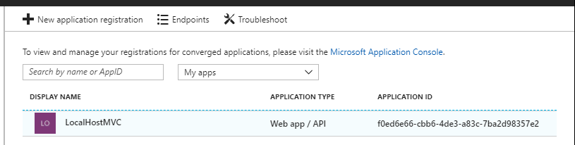

Good job, there's a new application!

## .NET Core MVC

Now a .NET Core MVC Application has to be created to fulfill the above settings.

The .NET Core CLI command to create such an application is this template:

```powershell
dotnet new mvc --auth SingleOrg --domain <DOMAIN> --tenant-id <TENANT_ID> --client-id <CLIENT_ID>
```

### Domain

Since I'm using the default Active Directory, mine is under **onmicrosoft.com**. The full title being **efcdeooutlook.onmicrosoft.com**.

### Tenant ID

This may be found under the Active Directory's Properties as "Directory ID"

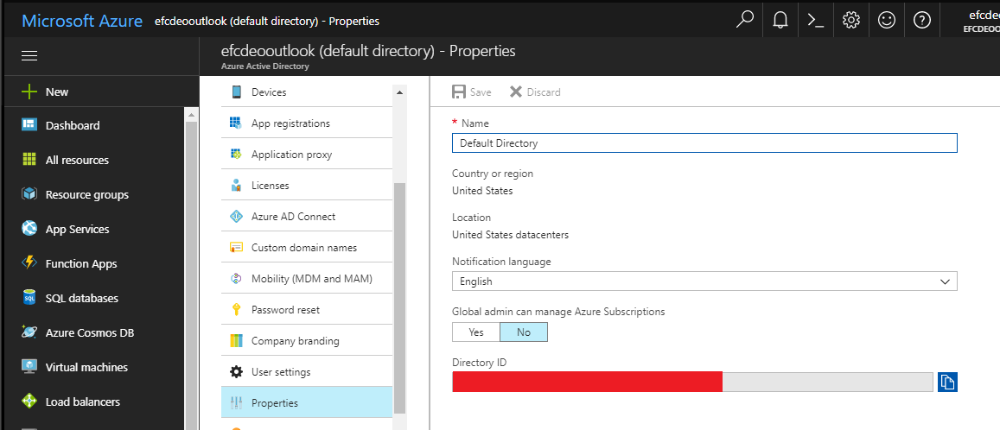

### Client ID

This may be found under the Active Directory's App Registration's Application ID

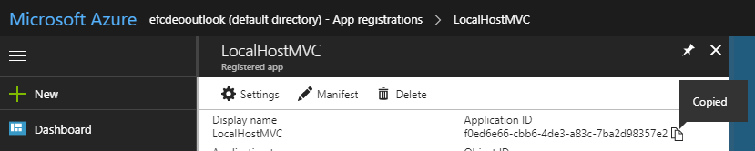

## Running

Now that the command is filled out, let's create a directory and run this (not showing my tenant ID):

```powershell
PS C:\Users\Daniel\Development> mkdir efcdeoSingleOrg


    Directory: C:\Users\Daniel\Development


Mode                LastWriteTime         Length Name
----                -------------         ------ ----
d-----        1/20/2018   4:49 PM                efcdeoSingleOrg


PS C:\Users\Daniel\Development> cd .\efcdeoSingleOrg\
PS C:\Users\Daniel\Development\efcdeoSingleOrg> dotnet new mvc --auth SingleOrg --domain efcdeooutlook.onmicrosoft.com --tenant-id 11111111-1111-1111-1111-111111111111 --client-id f0ed6e66-cbb6-4de3-a83c-7ba2d98357e2
The template "ASP.NET Core Web App (Model-View-Controller)" was created successfully.
This template contains technologies from parties other than Microsoft, see https://aka.ms/template-3pn for details.

Processing post-creation actions...
Running 'dotnet restore' on C:\Users\Daniel\Development\efcdeoSingleOrg\efcdeoSingleOrg.csproj...
  Restoring packages for C:\Users\Daniel\Development\efcdeoSingleOrg\efcdeoSingleOrg.csproj...
  Restoring packages for C:\Users\Daniel\Development\efcdeoSingleOrg\efcdeoSingleOrg.csproj...
  Restoring packages for C:\Users\Daniel\Development\efcdeoSingleOrg\efcdeoSingleOrg.csproj...
  Restore completed in 790.71 ms for C:\Users\Daniel\Development\efcdeoSingleOrg\efcdeoSingleOrg.csproj.
  Restore completed in 1.38 sec for C:\Users\Daniel\Development\efcdeoSingleOrg\efcdeoSingleOrg.csproj.
  Generating MSBuild file C:\Users\Daniel\Development\efcdeoSingleOrg\obj\efcdeoSingleOrg.csproj.nuget.g.props.
  Generating MSBuild file C:\Users\Daniel\Development\efcdeoSingleOrg\obj\efcdeoSingleOrg.csproj.nuget.g.targets.
  Restore completed in 3.49 sec for C:\Users\Daniel\Development\efcdeoSingleOrg\efcdeoSingleOrg.csproj.

Restore succeeded.

PS C:\Users\Daniel\Development\efcdeoSingleOrg> dotnet run
Hosting environment: Production
Content root path: C:\Users\Daniel\Development\efcdeoSingleOrg
Now listening on: http://localhost:5000
Application started. Press Ctrl+C to shut down.
```

### Error

Now go to _http://localhost:5000_ and see the error that will appear.

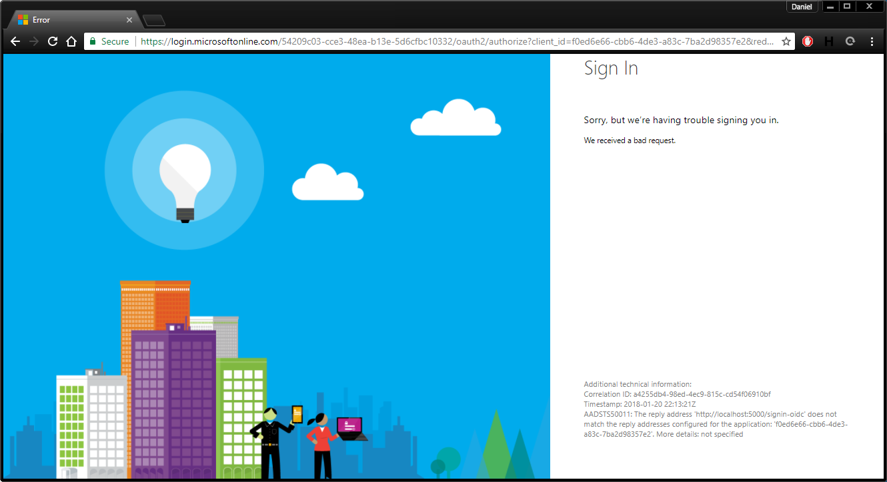

Hmmmm.... Something's still off.

### Reply URL

The application needs to have a Reply URL that Microsoft may send the user to that will log the user in, and then redirect the user to the main landing page. It's also good practice to have a Logout URL.

This Reply URL is _http://localhost:5000/signin-oidc_

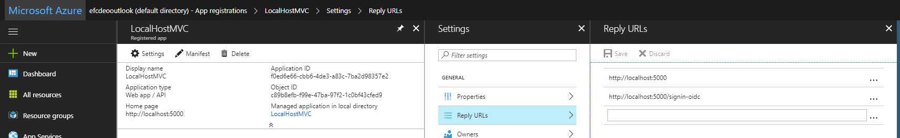

This Logout URL is _http://localhost:5000/signout-oidc_

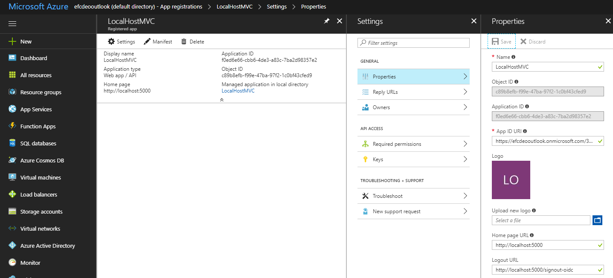

### Retry

Now open an incognito window and go to http://localhost:5000 and you should see this:

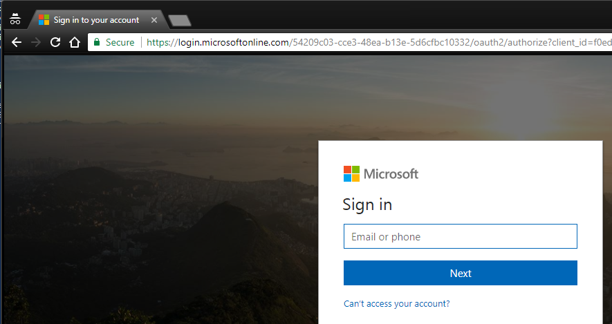

Go ahead and login with your Azure credentials and you will be redirected to your _http://localhost:5000_


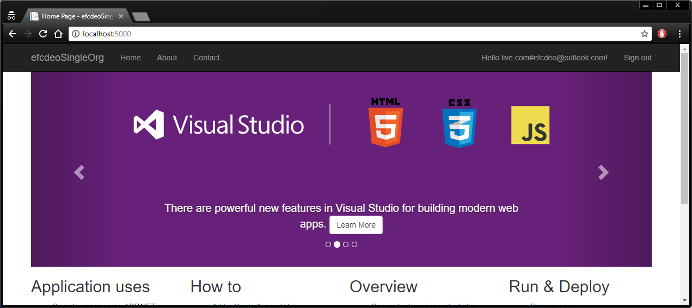

### Logout

Go ahead click Sign Out.

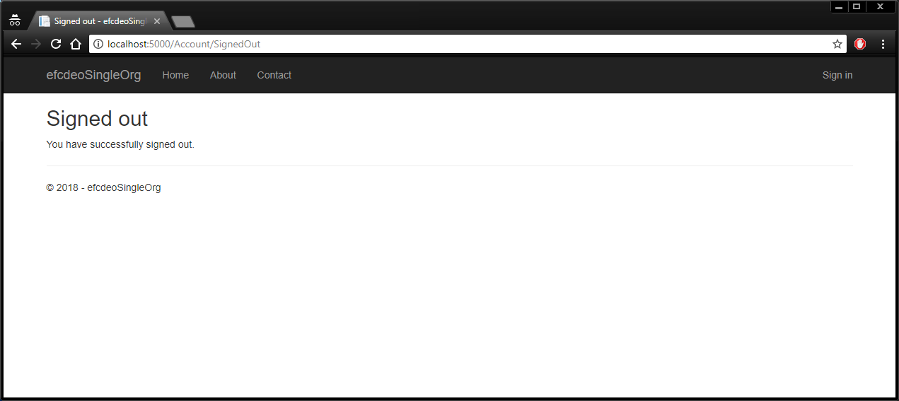

## Summary

By itself, there's little of value with this webpage since only I may login. But this is the same process that a business might add an application for their users.

[0]: https://www.visualstudio.com/dev-essentials/
[1]: https://portal.azure.com
