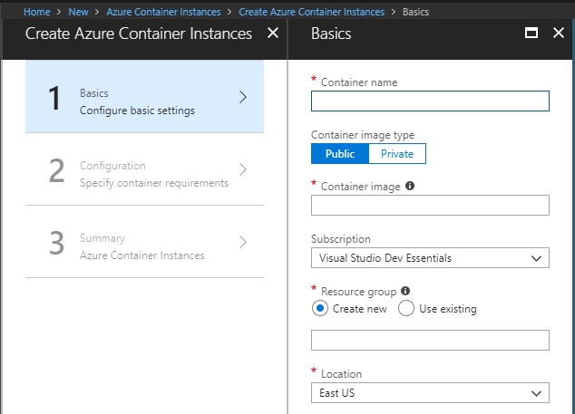
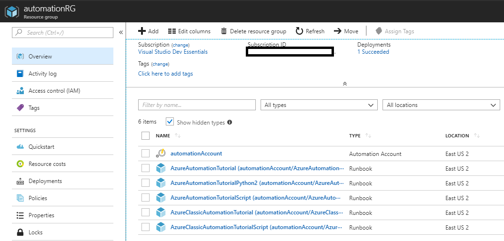
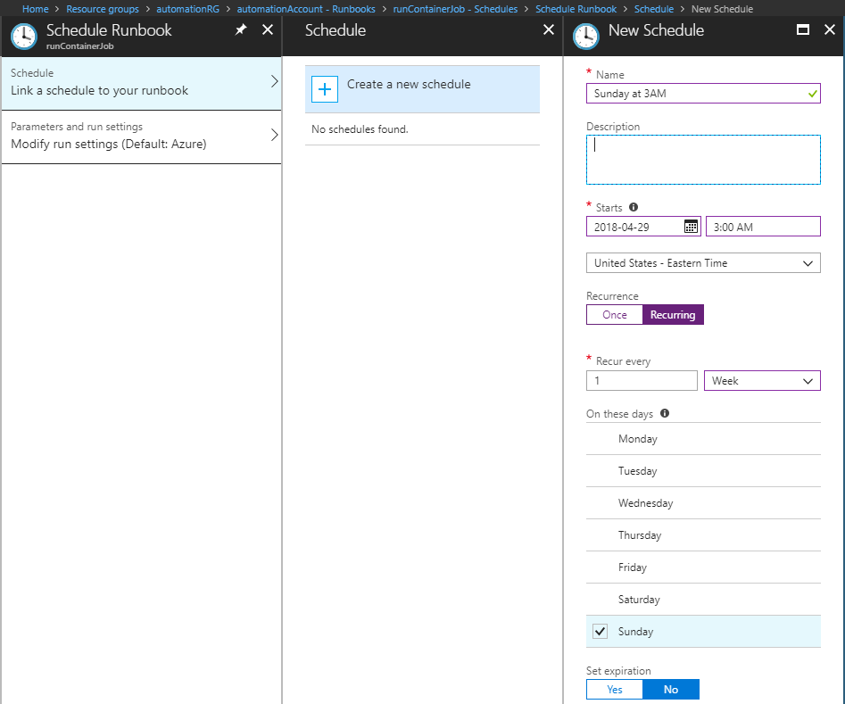

Containers of all kinds are a perfect use-case for one-off jobs and for isolating programs with invasive installation steps.

A nice next step is to make deployment and management of those containers easier. Kubernetes is the de-facto standard for containers at scale and there exists several options for managed Kubernetes services.

An alternative offering from Azure has appeared, [Azure Container Instances][0], to simplify running just a container. And a few days ago, Azure Container Instances became [Generally Available][1]. A big draw is per-second billing and very little setup.



## Azure Automation Account

[Azure Automation Accounts][2] are a fantastic way inside Azure to automate common tasks inside Azure from a central point.


I'm going to go ahead and create a new Resource Group and an Azure Automation Account. A few extra Tutorial Runbooks will be created as well.



There's a lot of use-cases for Azure Automation, but the one I want right now is Runbooks and it shows up under Process Automation.


Lets create a new Runbook with "Create a new runbook", and choosing the type as "Powershell".


Click Create and the new Runbook will be created, and then opened to edit mode.

Go ahead and enter this code:
```powershell
$Conn = Get-AutomationConnection -Name 'AzureRunAsConnection'

Add-AzureRMAccount -ServicePrincipal -Tenant $Conn.TenantID `
-ApplicationID $Conn.ApplicationID -CertificateThumbprint $Conn.CertificateThumbprint

New-AzureRmContainerGroup -ResourceGroupName automationRG -Name helloWorldJob -Image 'hello-world' -OsType Linux -RestartPolicy Never -Location eastus
```


Let's hit the Save button, and then the Test Pane button. An error will pop up like below. It's just saying that "New-AzureRmContainerGroup" can't be found.


Not being able to find this module is expected. The powershell module containing the Azure Container Instance cmdlets are in [AzureRM.ContainerInstance][3]

Let's go back up a few levels to the Automation Account and select "Modules" from the Shared Resources. You should notice that "AzureRM.ContainerInstance" is not in the installed list.


Click the "Update Azure Modules" just to make sure everything is up to date.

When updating all the modules is finished, click on "Browse Gallery", search for "AzureRM.ContainerInstance" and click "Import"


Go back to the created runbook, run the test again, and it should show up as success.


Look inside the Resource Group, and the Container Instance "mycontainer" will show up.


Unfortunately, the created container has terminated. The container is the Docker [hello-world][4], which is not meant to run for a long time. So this container runs to completion, and then stops. To prevent constant restart on completion, the setting "-RestartPolicy Never" on the container means it doesn't restart when finished. This is a great way to run a batch job.


So far, this has just been a Runbook that creates and runs an Azure Container Instance.

Let's go back to the Runbook and look at the empty Schedules tab.


Click on Add Schedule and setup a new schedule like this to run every Sunday at 3am in my timezone.



The new schedule shows up in the tab, and I can see when the next run is.


## Summary

It's easy to run container batch jobs on a simple schedule and only get billed for  the time used.

[0]: https://azure.microsoft.com/en-us/services/container-instances/
[1]: https://azure.microsoft.com/en-us/blog/azure-container-instances-now-generally-available/
[2]: https://azure.microsoft.com/en-us/documentation/learning-paths/automation/
[3]: https://docs.microsoft.com/en-us/powershell/module/azurerm.containerinstance/get-azurermcontainergroup?view=azurermps-5.7.0
[4]: https://hub.docker.com/_/hello-world/
