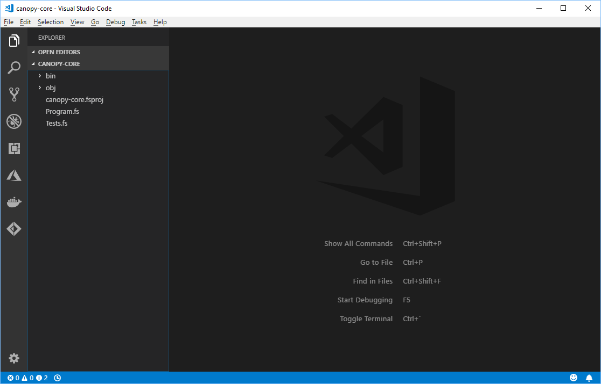
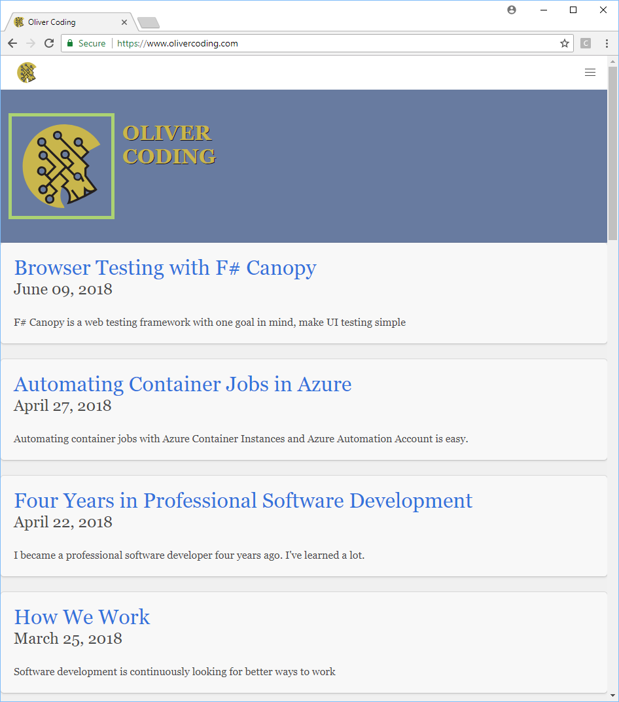

Three years ago, I attended a .NET Users meetup where the speaker demonstrated using F# and [Canopy][0] to run UI tests on his website. I found it extremely interesting as it was my introduction to F#, to Canopy, and even to web testing.

Canopy is a F# wrapper around the browser automation framework [Selenium][2].

The below is how to get started with testing on the browser with F# and Canopy.

## Requirements

The requirements to get started with F# and Canopy for web testing are easy:

1. [Install Visual Studio Code][1]
2. [.NET Core 2.1 SDK][3]
3. [Google Chrome Browser][5] (this isn't required by anything other than this tutorial)

### Optional

It's not required, but I like to make development easier with this extension to VS Code.

1. [Ionide F# VS Code][4]

## Project setup

Create a new folder, and then open powershell to that directory.

Run the following commands

```powershell
dotnet new xunit -lang F#
dotnet add package canopy
dotnet add package Selenium.WebDriver.ChromeDriver
```

Open up Visual Studio Code and then open that folder. It should look something like this:



Click on that file "canopy-core.fsproj" (or whatever you named that folder).

Add the following line as shown in the xml below.
```xml
<CopyLocalLockFileAssemblies>true</CopyLocalLockFileAssemblies>
```

Notice the line is inside the PropertyGroup.

```xml
<Project Sdk="Microsoft.NET.Sdk">

  <PropertyGroup>
    <TargetFramework>netcoreapp2.1</TargetFramework>
    <RootNamespace>canopy_core</RootNamespace>

    <IsPackable>false</IsPackable>

    <CopyLocalLockFileAssemblies>true</CopyLocalLockFileAssemblies>
  </PropertyGroup>

  <ItemGroup>
    <Compile Include="Tests.fs" />
    <Compile Include="Program.fs" />
  </ItemGroup>

  <ItemGroup>
    <PackageReference Include="canopy" Version="2.0.1" />
    <PackageReference Include="Microsoft.NET.Test.Sdk" Version="15.7.0" />
    <PackageReference Include="Selenium.WebDriver.ChromeDriver" Version="2.40.0" />
    <PackageReference Include="xunit" Version="2.3.1" />
    <PackageReference Include="xunit.runner.visualstudio" Version="2.3.1" />
    <DotNetCliToolReference Include="dotnet-xunit" Version="2.3.1" />
  </ItemGroup>

</Project>
```

Now from powershell again in that directory, run this command to make sure the project compiles and gives a successful (but empty) test.

```powershell
dotnet test
```

## First Test

Open the file "Tests.fs" that was created automatically, and replace the contents of that file with this.

```fsharp
module Tests

open Xunit
open canopy.parallell

[<Fact>]
let ``Hightlight Google Image Test`` () =
    use browser = functions.start canopy.types.Chrome
    functions.url "https://www.google.com" browser
    functions.highlight "#hplogo" browser
    functions.sleep 5
    Assert.True(true)
```

From powershell again, rerun this command.

```powershell
dotnet test
```

You should see Chrome open, and display this for 5 seconds before closing. Notice that the logo has been highlighted.



The output in powershell will look like this. All tests run successfully.

```powershell
PS C:\Users\Daniel\Development\canopy-core> dotnet test
C:\Users\Daniel\Development\canopy-core\canopy-core.fsproj : warning NU1701: Package 'canopy 2.0.1' was restored using '.NETFramework,Version=v4.6.1' instead of the project target framework '.NETCoreApp,Version=v2.1'. This package may not be fully compatible with your project.
Build started, please wait...
C:\Users\Daniel\Development\canopy-core\canopy-core.fsproj : warning NU1701: Package 'canopy 2.0.1' was restored using '.NETFramework,Version=v4.6.1' instead of the project target framework '.NETCoreApp,Version=v2.1'. This package may not be fully compatible with your project.
Build completed.

Test run for C:\Users\Daniel\Development\canopy-core\bin\Debug\netcoreapp2.1\canopy-core.dll(.NETCoreApp,Version=v2.1)
Microsoft (R) Test Execution Command Line Tool Version 15.7.0
Copyright (c) Microsoft Corporation.  All rights reserved.

Starting test execution, please wait...

Total tests: 1. Passed: 1. Failed: 0. Skipped: 0.
Test Run Successful.
Test execution time: 11.0285 Seconds
PS C:\Users\Daniel\Development\canopy-core>
```


## Second Test

Let's add a second test to that file "Tests.fs". This test is an abbreviated version of the standard Canopy examples.

```fsharp
[<Fact>]
let ``Test Canopy Page`` () =
    use browser = functions.start canopy.types.Chrome
    functions.url "http://lefthandedgoat.github.io/canopy/testpages/" browser
    
    Assert.Equal("Welcome", (functions.element "#welcome" browser).Text)
    Assert.Equal("button not clicked", (functions.element "#button_clicked" browser).Text)
    Assert.Equal("some Nonsense", (functions.element "#button_clicked" browser).Text)
```

Rerun the tests and an error will appear.

```powershell
Starting test execution, please wait...
[xUnit.net 00:00:13.9036790]     Tests.Test Canopy Page [FAIL]
Failed   Tests.Test Canopy Page
Error Message:
 Assert.Equal() Failure
           (pos 0)
Expected: some Nonsense
Actual:   button not clicked
           (pos 0)
Stack Trace:
   at Tests.Test Canopy Page() in C:\Users\Daniel\Development\canopy-core\Tests.fs:line 21

Total tests: 2. Passed: 1. Failed: 1. Skipped: 0.
Test Run Failed.
Test execution time: 14.3788 Seconds
```

## Summary

Combining Web Testing with a Unit Testing framework makes writing tests for the browser easy. The next steps are to write tests, to write functions for login methods, and to include other browsers for testing.  I hope you find testing Chrome browser with F# and Canopy as easy and as enjoyable as I do!

[0]: http://lefthandedgoat.github.io/canopy/
[1]: https://code.visualstudio.com/
[2]: https://www.seleniumhq.org/
[3]: https://www.microsoft.com/net/download/windows
[4]: https://marketplace.visualstudio.com/items?itemName=Ionide.Ionide-fsharp
[5]: https://www.google.com/chrome/
