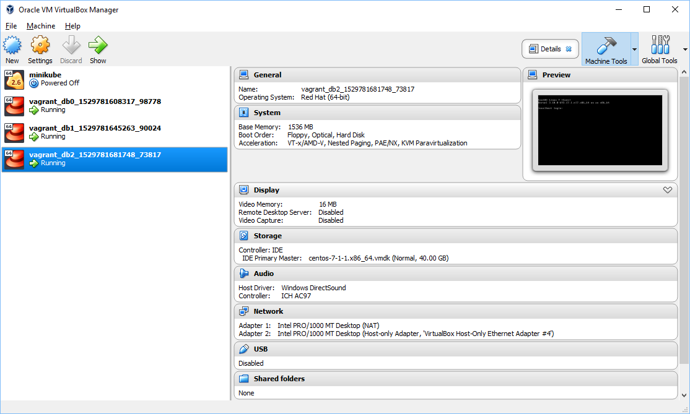
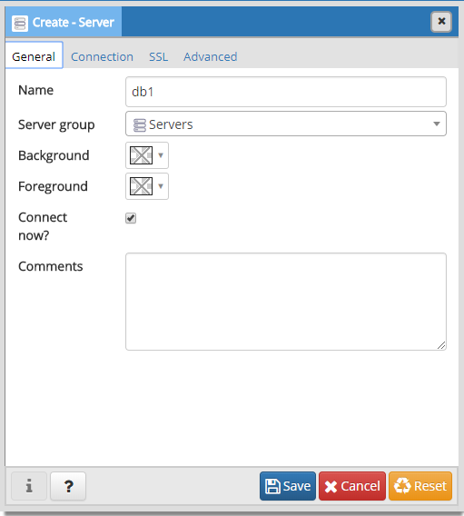
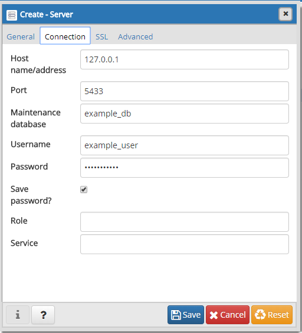
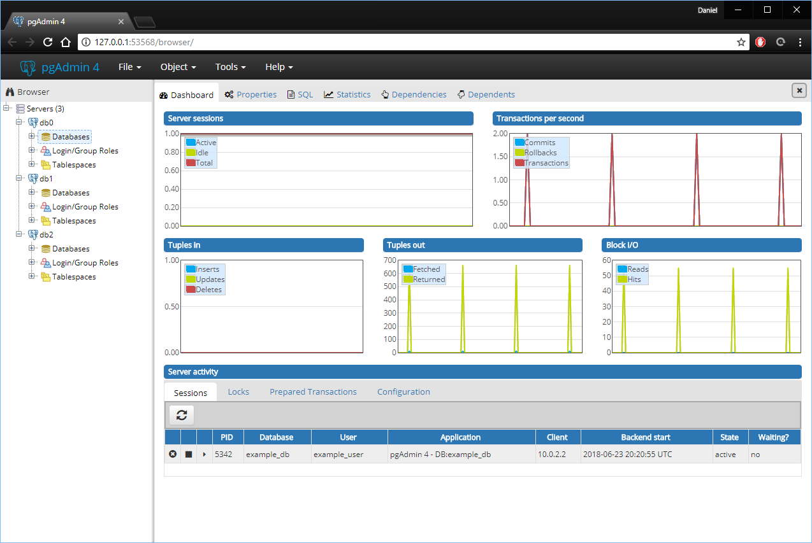

My purpose is to show installing Postgres via Ansible, but along the way I'm going to show how to use Vagrant to create local machines for testing.

## Environment

Here's what my installs look like:

* Windows 10 Home Edition
* [VirtualBox 5.2.8][0]
    * _Note that this is installed as administrator._
* [Vagrant 2.1.1][2]
* [Windows Subsystem For Linux (Ubuntu 16.04)][1]
* [pgAdmin 4 v3.0][5]

On that Windows Subsystem for Linux I have these installed:

* Python 2.7.12
* [Ansible 2.5.0][3]

I'll let you install these on your own. The process is reasonably straightforward.

## Folder structure

Here's what my folder structure for this looks like:

```
AnsiblePostgres
| - ansible
| - vagrant
```

## Vagrant

Vagrant makes creating machines easy and reproducible. With a few short commands I can have a new VM and login.

Here's a quickstart three commands to create a new box, start it, and then ssh into it.

```powershell
vagrant init centos/7
vagrant up
vagrant ssh
```

But let's take a step back and start with just starting a new box.

```powershell
vagrant init centos/7
```

This creates a new file in the folder called "VagrantFile".  Open it up and replace it with the text below:

```ruby
Vagrant.configure("2") do |config|
  config.vm.box = "centos/7"
  config.vm.network "private_network", type: "dhcp"

  config.vm.define "db0" do |db0| 
    db0.vm.network "forwarded_port", guest: 5432, host: 5432
  end
  
  config.vm.define "db1" do |db1|
    db1.vm.network "forwarded_port", guest: 5432, host: 5433
  end

  config.vm.define "db2" do |db2| 
    db2.vm.network "forwarded_port", guest: 5432, host: 5434
  end

  config.vm.provider "virtualbox" do |vb|
    vb.memory = "1536"
  end

end
```

Now do vagrant up.

```powershell
vagrant up
```

If you open VirtualBox you should see three virtual machines come online.



Each of the virtual machines (VMs) may be ssh'd into via Vagrant as below:

```powershell
vagrant ssh db0
```

## Ansible

Now go into the ansible folder from the structure above and create a new file "ansible.cfg"

```yaml
[defaults]
host_key_checking=False
inventory=hosts-vagrant
timeout=30

[ssh_connection]
ssh_args="-F ~/.vagrant_keys/vagrant-ssh.cfg"
```

1. "host\_key_checking=False" should not be false for anything besides a local machine dev environment.
2. "ssh\_args=\"-F ~/.vagrant_keys/vagrant-ssh.cfg\"" tells where the SSH config file is. We'll make that later.
3. "inventory=hosts-vagrant" lists the VMs.

Create a new file named "hosts-vagrant" to list out our "inventory" or list of files. The only contents of that file should be this:

```
[database]
db[0:2]
```

Before we can use ansible, we have to setup the SSH config.

## Vagrant SSH Config

Now unfortunately, Ansible can't use "vagrant ssh" to access the machines. So let's write a SSH config file so Ansible can.

Run this powershell script from inside the same directory that the "Vagrantfile" is. This script will
1. Copy vagrant private keys to "~/.vagrant_keys" inside Windows-Subsystem-Linux
2. Modify private key file permissions to be appropriate.
3. Write SSH Config file.
4. Modify Ansible config file with SSH config location.

```powershell
# Get the Vagrant SSH with paths for Windows-Subsystem-Linux
$fileText = vagrant ssh-config | ForEach-Object {$_ -replace 'C:/', '/mnt/c/'}

# Save vagrant SSH to this path
$vagrantFolder = "~/.vagrant_keys"
bash -c "mkdir -p $vagrantFolder"
bash -c "chmod 700 $vagrantFolder"
# Each of the private key files
$bashkeyFiles = $fileText | Select-String -Pattern "/mnt/c" -CaseSensitive
foreach ($item in $bashkeyFiles) {
    $index = $bashkeyFiles.IndexOf($item)
    $oldFilename = $item -replace '^(.*)/mnt/c/', '/mnt/c/'
    $newFilename = $vagrantFolder + "/private_key" + $index
    bash -c "cp $oldFilename $newFilename"
    bash -c "chmod 600 $newFilename"
    $fileText = $fileText | ForEach-Object { $_ -replace $oldFilename, $newFilename }
}
$fileText | Out-File -FilePath "vagrant-ssh.cfg" -Encoding ASCII
bash -c "mv ./vagrant-ssh.cfg $vagrantFolder/vagrant-ssh.cfg"
bash -c "chmod 644 $vagrantFolder/vagrant-ssh.cfg"

# Ansible likes absolute path instead of tilda for home path.
$ansibleCfg = Get-Content "../ansible/ansible.cfg" | ForEach-Object { $_ -replace "(~)|(/home/[^/]*)", (bash -c "readlink -e ~") }
$ansibleCfg | Out-File "../ansible/ansible.cfg" -Encoding ASCII
```
<br/>

If I go to that directory and type "ls -la" I can see this. One private key for each of those Virtual Machines, and one SSH config file.

```bash
doliver@DESKTOP-JGPLO92:~/.vagrant_keys$ ls -la
total 16
drwx------ 1 doliver doliver 4096 Jun 23 15:21 .
drwxr-xr-x 1 doliver doliver 4096 Jun 23 14:22 ..
-rw------- 1 doliver doliver 1706 Jun 23 15:21 private_key0
-rw------- 1 doliver doliver 1706 Jun 23 15:21 private_key1
-rw------- 1 doliver doliver 1702 Jun 23 15:21 private_key2
-rw-r--r-- 1 doliver doliver  711 Jun 23 15:21 vagrant-ssh.cfg
```

## Running ansible

Now go back to the ansible folder and run "ansible all -m ping" command from inside Windows-Subsystem-Linux:

```bash
$ ansible all -m ping
db2 | SUCCESS => {
    "changed": false,
    "ping": "pong"
}
db0 | SUCCESS => {
    "changed": false,
    "ping": "pong"
}
db1 | SUCCESS => {
    "changed": false,
    "ping": "pong"
}
```

Let's use the most popular "role" for installing [PostgreSQL from Ansible][4] via Ansible Galaxy. Install the files locally with this:

```bash
$ ansible-galaxy install geerlingguy.postgresql
```

Create a new file called "postgres-playbook.yml" and place this text in it:

```yaml
---
- hosts: database
  vars_files:
    - vars/postgresql.yml
  roles:
    - role: geerlingguy.postgresql
      become: yes
```
There's a variable file there to fill out, so create it in the sub-directory "vars" and name it "postgresql.yml" and put this text in it:

**Disclaimer: THIS IS NOT A SECURE DATABASE**

```yaml
postgresql_databases:
  - name: example_db
postgresql_users:
  - name: example_user
    password: supersecure
postgresql_global_config_options:
  - option: listen_addresses
    value: '*'
  - option: ssl
    value: off
postgresql_hba_entries:
  - { type: local, database: all, user: postgres, auth_method: peer }
  - { type: local, database: all, user: all, auth_method: peer }
  - { type: host, database: all, user: all, address: '127.0.0.1/32', auth_method: md5 }
  - { type: host, database: all, user: all, address: '::1/128', auth_method: md5 }
  - { type: host, database: all, user: all, address: '0.0.0.0/0', auth_method: md5 }
```

And run it via:

```bash
$ ansible-playbook postgres-playbook.yml
```


## Admin

Now on local machine open up pgAdmin and add three new servers. The reason there are three ports listed there, is because each of the three virtual machines is available through one of those ports.

* Names: db0, db1, db2
* Host: 127.0.0.1
* Ports: 5432, 5433, 5434
* Maintenance DB: example_db
* User: example_user
* Password: supersecure







<br/>

And now there are three PostgreSQL instances running locally:



## Summary

[Here is the code.][6]

Being able to recreate installs and servers consistently is very important to speed, security, and correctness. The setup for PostgreSQL here isn't sufficient to create a secure install, but it's a starting point.

Running applications on local virtual machines with Vagrant is very nice. And then taking the exact same Ansible setup code (though certainly different variables) to production makes it super simple and easy to get right.


[0]: https://www.virtualbox.org/
[1]: https://docs.microsoft.com/en-us/windows/wsl/install-win10
[2]: https://www.vagrantup.com/
[3]: https://docs.ansible.com/ansible/2.5/user_guide/windows_faq.html
[4]: https://galaxy.ansible.com/geerlingguy/postgresql/
[5]: https://www.pgadmin.org/
[6]: https://github.com/DanielOliver/AnsiblePostgres
