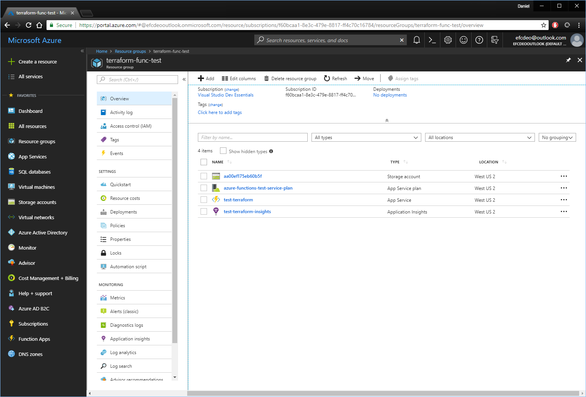
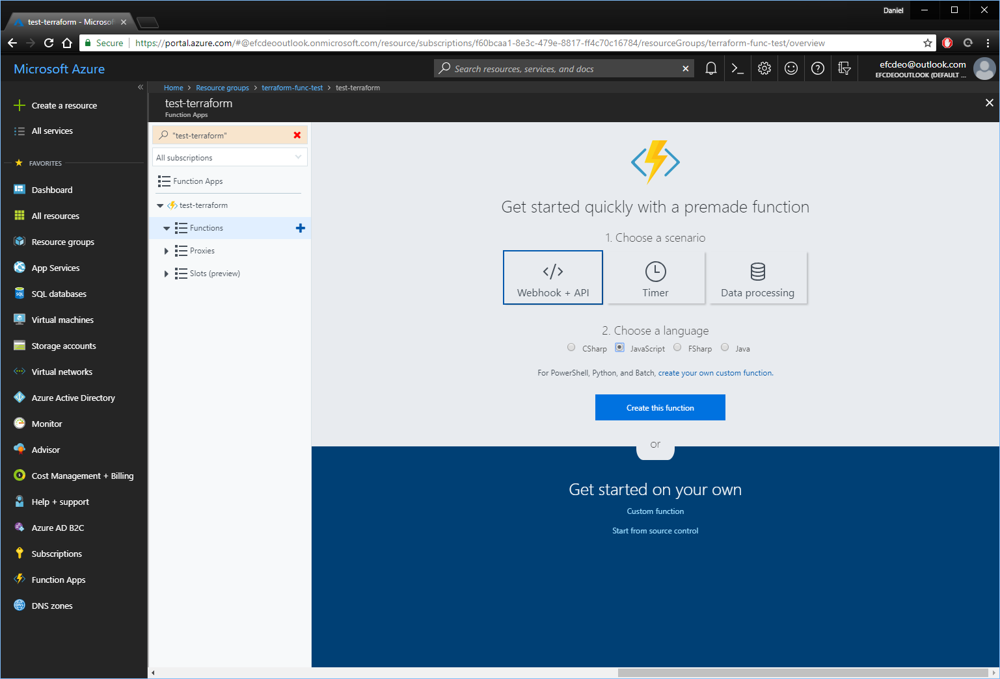
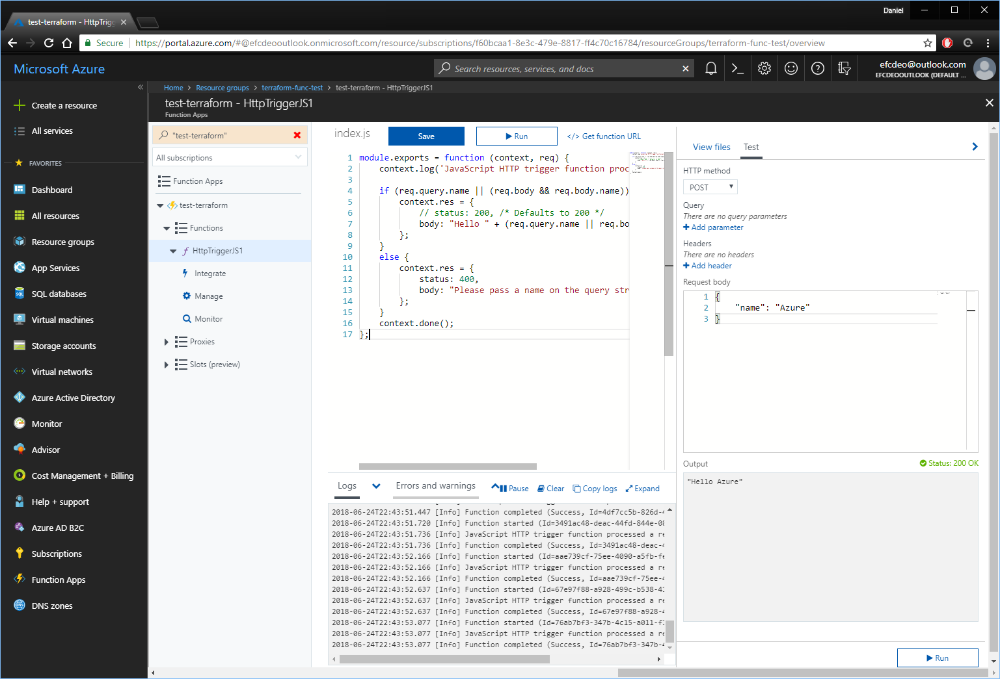
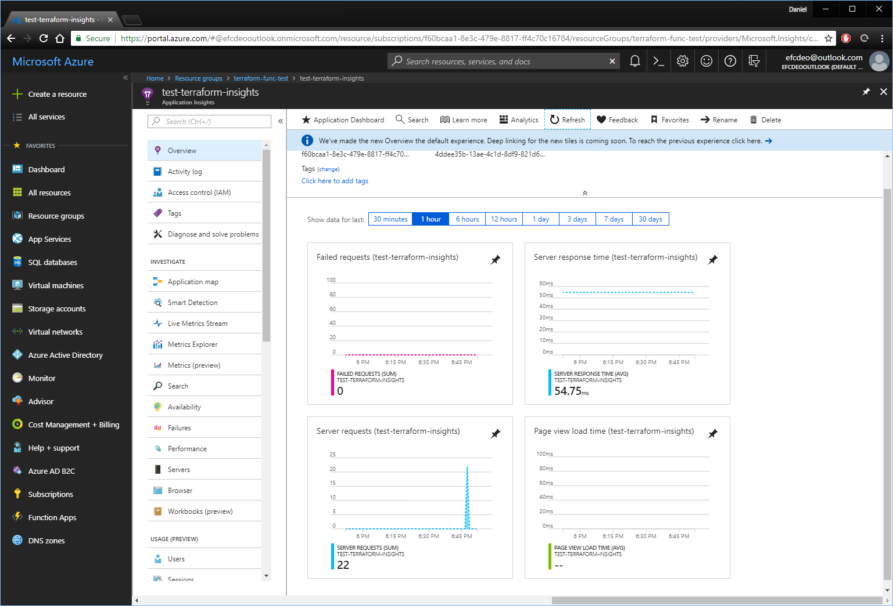

Terraform is a fantastic tool for concisely defining and creating cloud resources.

## Requirements

* [Download Terraform and place it in the path.][0]
* [Download and install Azure CLI.][3]

## Terraform definition

The desired resource is an Azure Function Application.  There's a handy [Terraform template here][1].

Unfortunately, this Terraform template doesn't include Azure Application Insights, which has its own [template here][2].

Create a new file named "azure_func.tf" and place this code in it, which is a combination of the two above templates.

```terraform
resource "azurerm_resource_group" "test" {
  name     = "terraform-func-test"
  location = "westus2"
}

resource "random_id" "server" {
  keepers = {
    # Generate a new id each time we switch to a new Azure Resource Group
    rg_id = "${azurerm_resource_group.test.name}"
  }

  byte_length = 8
}

resource "azurerm_storage_account" "test" {
  name                     = "${random_id.server.hex}"
  resource_group_name      = "${azurerm_resource_group.test.name}"
  location                 = "${azurerm_resource_group.test.location}"
  account_tier             = "Standard"
  account_replication_type = "LRS"
}

resource "azurerm_app_service_plan" "test" {
  name                = "azure-functions-test-service-plan"
  location            = "${azurerm_resource_group.test.location}"
  resource_group_name = "${azurerm_resource_group.test.name}"
  kind                = "FunctionApp"

  sku {
    tier = "Dynamic"
    size = "Y1"
  }
}

resource "azurerm_application_insights" "test" {
  name                = "test-terraform-insights"
  location            = "${azurerm_resource_group.test.location}"
  resource_group_name = "${azurerm_resource_group.test.name}"
  application_type    = "Web"
}

resource "azurerm_function_app" "test" {
  name                      = "test-terraform"
  location                  = "${azurerm_resource_group.test.location}"
  resource_group_name       = "${azurerm_resource_group.test.name}"
  app_service_plan_id       = "${azurerm_app_service_plan.test.id}"
  storage_connection_string = "${azurerm_storage_account.test.primary_connection_string}"

  app_settings {
    "AppInsights_InstrumentationKey" = "${azurerm_application_insights.test.instrumentation_key}"
  }
}
```

<br/>

This Azure Function and Application Insight template only differs from the Terraform documentation in two ways.

1. An Azure Function is associated with an Application Insights instance by adding the Instrumentation Key to the App Settings of the Azure Function application.

```terraform
  app_settings {
    "AppInsights_InstrumentationKey" = "${azurerm_application_insights.test.instrumentation_key}"
  }
```

<br/>

2. Using a random ID for the Azure Storage Account gives it a better chance of being a unique URL.

```terraform
resource "random_id" "server" {
  keepers = {
    # Generate a new id each time we switch to a new Azure Resource Group
    rg_id = "${azurerm_resource_group.test.name}"
  }

  byte_length = 8
}
```

## Running Terraform

First of all, open the directory in powershell and run "az login" to login with the Azure CLI.

```powershell
PS C:\Users\Daniel\Development\terra_test> az login
To sign in, use a web browser to open the page https://microsoft.com/devicelogin and enter the code ________ to authenticate.
[
  {
    "cloudName": "AzureCloud",
    "id": "<id redacted>",
    "isDefault": true,
    "name": "Visual Studio Dev Essentials",
    "state": "Enabled",
    "tenantId": "<tenant id redacted>",
    "user": {
      "name": "<user name redacted>",
      "type": "user"
    }
  }
]
```

<br/>

Open the directory in powershell and type "terraform init".

```powershell
PS C:\Users\Daniel\Development\terra_test> terraform init

Initializing provider plugins...
- Checking for available provider plugins on https://releases.hashicorp.com...
- Downloading plugin for provider "azurerm" (1.7.0)...
- Downloading plugin for provider "random" (1.3.1)...

The following providers do not have any version constraints in configuration,
so the latest version was installed.

To prevent automatic upgrades to new major versions that may contain breaking
changes, it is recommended to add version = "..." constraints to the
corresponding provider blocks in configuration, with the constraint strings
suggested below.

* provider.azurerm: version = "~> 1.7"
* provider.random: version = "~> 1.3"

Terraform has been successfully initialized!

You may now begin working with Terraform. Try running "terraform plan" to see
any changes that are required for your infrastructure. All Terraform commands
should now work.

If you ever set or change modules or backend configuration for Terraform,
rerun this command to reinitialize your working directory. If you forget, other
commands will detect it and remind you to do so if necessary.
```

<br/>

Then run "terraform apply" to create (or update) the contents of that file.

```powershell
PS C:\Users\Daniel\Development\terra_test> terraform apply
An execution plan has been generated and is shown below.
Resource actions are indicated with the following symbols:
  + create

Terraform will perform the following actions:
...
```

<br/>

Open up Azure Portal and look at the new Resource Group



## Testing Function works with App Insights

Open up the Azure Function and create a new Javascript Webhook.




Run the default function a few times as-is.




Go look at the App Insights resource and see that the function was run a few times.



## Quickstart

```powershell
> az login
> terraform init
> terraform apply
```


## Summary

All the Terraform code is above.

Fifty lines of Terraform gives me a working Azure Functions resource group, and it's fantastically concise, and accurate code. Terraform looks like a great resource for defining cloud resources, no matter the cloud.

[0]: https://www.terraform.io/
[1]: https://www.terraform.io/docs/providers/azurerm/r/function_app.html
[2]: https://www.terraform.io/docs/providers/azurerm/r/application_insights.html
[3]: https://docs.microsoft.com/en-us/cli/azure/install-azure-cli?view=azure-cli-latest
