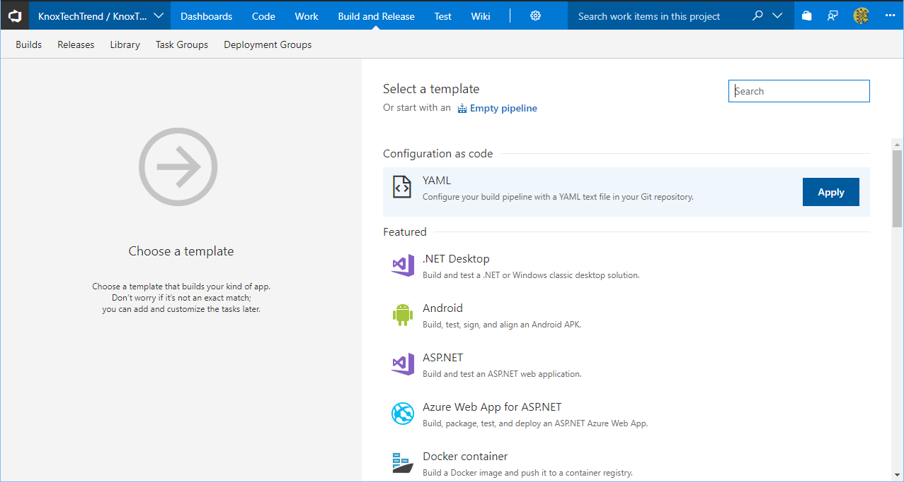

VSTS has a preview feature to allows builds to be defined in YAML and stored in Git with your code.

[**Disclaimer: VSTS preview feature**][0]

## Enabling feature in VSTS


Preview features can be found on the top right of VSTS under profile.


Do note that this feature affects all users.

## VSTS Build YAML

In the root of your git repository, create a file named ".vsts-ci.yml". This is the set of tasks that will represent your build.

My build currently is fairly basic and consists of copying raw text files, which will be used in release definition.  Even so, here's what my build definition looks like in YAML.  More information about these tasks is available [here][1].

```yaml
steps:
- task: CopyFiles@2
  displayName: Copy ARM template
  inputs:
    SourceFolder: 'azure/arm'
    TargetFolder: '$(Build.ArtifactStagingDirectory)/arm'
    CleanTargetFolder: true
    OverWrite: true

- task: CopyFiles@2
  displayName: Copy ARM parameters
  inputs:
    SourceFolder: 'azure/parameters'
    TargetFolder: '$(Build.ArtifactStagingDirectory)/arm_parameters'
    CleanTargetFolder: true
    OverWrite: true

- task: PublishBuildArtifacts@1
  displayName: Publish Artifacts
  inputs:
    PathtoPublish: '$(Build.ArtifactStagingDirectory)'
    ArtifactName: artifacts
```

Commit the repository and push it.

## Creating Build

Go to the Build tab and create a new Build Definition.


Select YAML template at the top.



Choose the YAML file in the repository that contains the YAML build file.


Save the Build Definition.


## Queue new build

Queue a new build.


## Summary

Storing the build steps as text inside version control is a fantastic concept because the build steps evolve with the code. Any changes to build steps go through the same processes as a code review.

Not to mention, we get history on the build steps from source control AND we can share the repository and anyone could set up their copy of the code in VSTS.

[0]: https://docs.microsoft.com/en-us/vsts/pipelines/build/yaml?view=vsts
[1]: https://github.com/Microsoft/vsts-agent/blob/master/docs/preview/yamlgettingstarted.md
