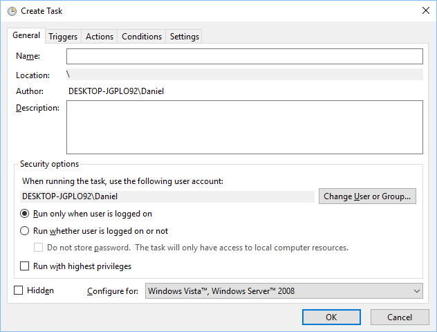
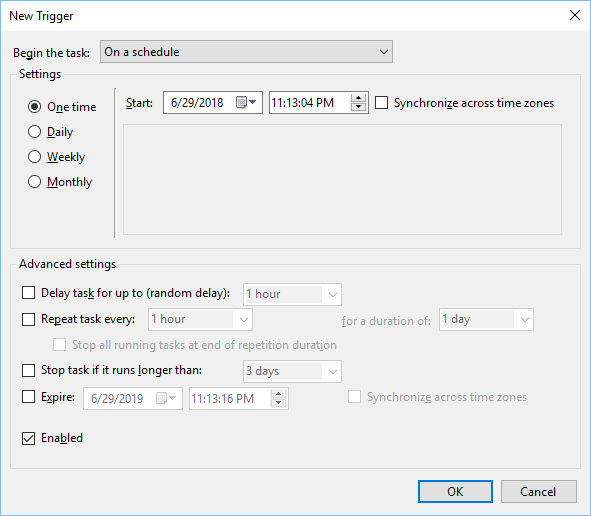
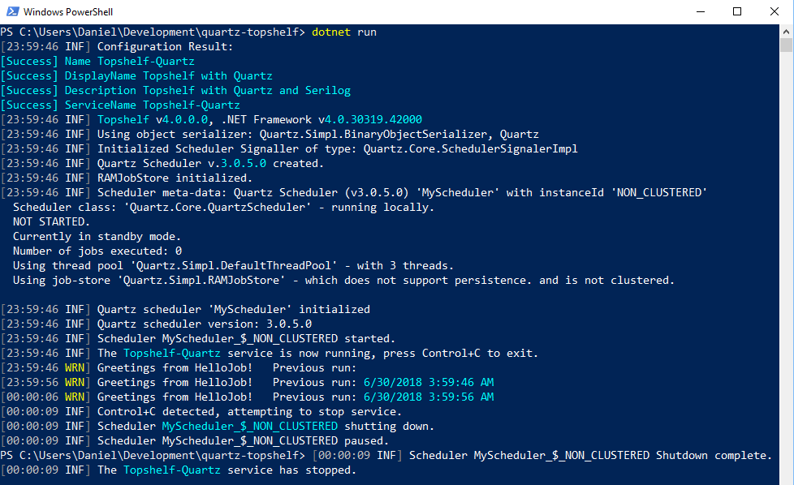
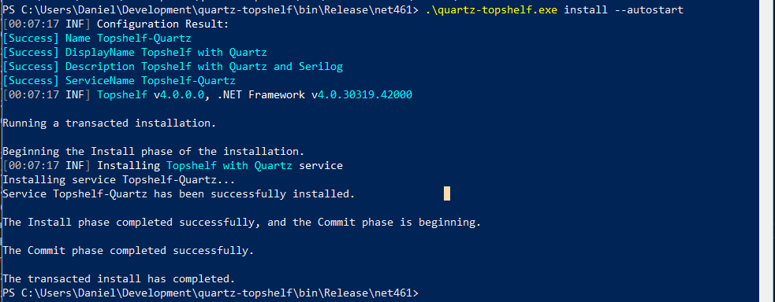
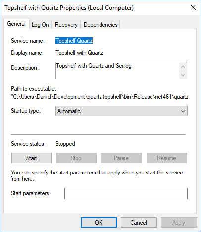
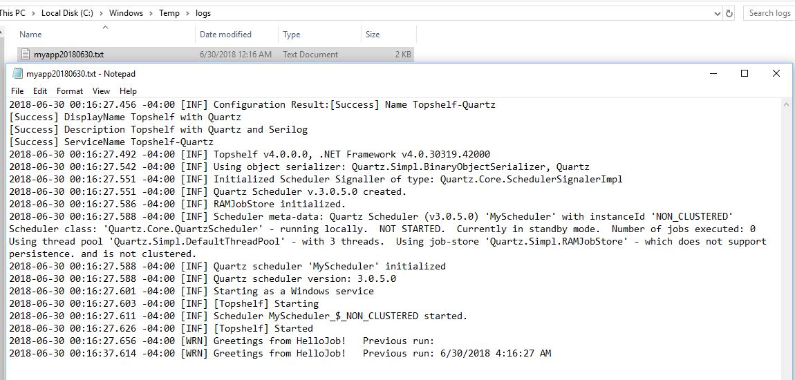
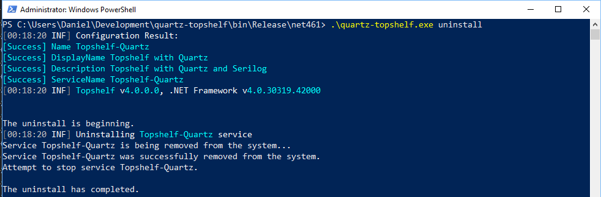

A common method of making background job processors on Windows is to schedule an executable on a windows task.





## Quartz.NET

A more flexible way is to schedule tasks from inside C# using the .NET port of the Quartz scheduler.

A common way of scheduling a job with Quartz looks something like this [excerpt from Quartz's documentation][0].

```csharp
IJobDetail job = JobBuilder.Create<HelloJob>()
    .WithIdentity("job1", "group1")
    .Build();

// Trigger the job to run now, and then repeat every 10 seconds
ITrigger trigger = TriggerBuilder.Create()
    .WithIdentity("trigger1", "group1")
    .StartNow()
    .WithSimpleSchedule(x => x
        .WithIntervalInSeconds(10)
        .RepeatForever())
    .Build();

// Tell quartz to schedule the job using our trigger
await scheduler.ScheduleJob(job, trigger);
```

## Topshelf

The problem now is that a C# program needs to be run forever and auto-started to let Quartz continue scheduling jobs.

[Enter Topshelf][1]

> Topshelf is a framework for hosting services written using the .NET framework. The creation of services is simplified, allowing developers to create a simple console application that can be installed as a service using Topshelf. The reason for this is simple: It is far easier to debug a console application than a service. And once the application is tested and ready for production, Topshelf makes it easy to install the application as a service.

A quick sample of the code to create a service using Topshelf looks like this. Defining how to start and stop a service, and giving it a name.

```csharp
var rc = HostFactory.Run(x =>
{
    x.Service<ScheduleService>(s =>
    {
        s.ConstructUsing(name => new ScheduleService());
        s.WhenStarted(tc => tc.Start());
        s.WhenStopped(tc => tc.Stop());
    });
    x.RunAsLocalSystem();

    x.SetDescription("Topshelf with Quartz");
    x.SetDisplayName("Topshelf with Quartz");
    x.SetServiceName("Topshelf-Quartz");
});

var exitCode = (int)Convert.ChangeType(rc, rc.GetTypeCode());
Environment.ExitCode = exitCode;
```

## Serilog

Serilog is a fantastic tool for simple structured logging in C#. Another easy quick-start looks like this.

```csharp
Log.Logger = new LoggerConfiguration()
    .MinimumLevel.Information()
    .WriteTo.Console()
    .WriteTo.File("log.txt",
        rollingInterval: RollingInterval.Day,
        rollOnFileSizeLimit: true)
    .CreateLogger();
    
Log.Information("Hello, Serilog!");

Log.CloseAndFlush();
```

## Combining the concepts

Combining all these concepts takes a few steps.

1. Create a job to run.
2. Create a Quartz .NET scheduler.
3. Schedule the job to run.
4. Start and shutdown scheduler with Topshelf.
5. Setup Serilog to log information.
6. Run service from command line
7. Install service with Topshelf.

But first of all, let's setup a new project and add dependencies. This is using .NET 4.6.1, but I like using .NET Core command line.

```powershell
mkdir quartz-topshelf
cd quartz-topshelf
dotnet new console --target-framework-override net461
dotnet add package Quartz
dotnet add package Serilog
dotnet add package Serilog.Sinks.Console
dotnet add package Serilog.Sinks.File
dotnet add package Topshelf
dotnet add package Topshelf.serilog
```

### 1. Create a job to run

This job will greet the user and tell the last time that the job ran.  Note that "Log.Warning" is being used here to make it easy to differentiate in log.

```csharp
public class HelloJob : IJob
{
    public Task Execute(IJobExecutionContext context)
    {
        var lastRun = context.PreviousFireTimeUtc?.DateTime.ToString() ?? string.Empty;
        Log.Warning("Greetings from HelloJob!   Previous run: {lastRun}", lastRun);
        return Task.CompletedTask;
    }
}
```

### 2. Create a Quartz .NET scheduler and 3. Schedule the above job to run

* This Quartz scheduler has 3 threads.
* This Quartz scheduler stores everything in RAM.
* "ScheduleJobs" adds one job that runs once every ten seconds forever.

```csharp
public class ScheduleService
{
    private readonly IScheduler scheduler;
    public ScheduleService()
    {
        NameValueCollection props = new NameValueCollection
        {
            { "quartz.serializer.type", "binary" },
            { "quartz.scheduler.instanceName", "MyScheduler" },
            { "quartz.jobStore.type", "Quartz.Simpl.RAMJobStore, Quartz" },
            { "quartz.threadPool.threadCount", "3" }
        };
        StdSchedulerFactory factory = new StdSchedulerFactory(props);
        scheduler = factory.GetScheduler().ConfigureAwait(false).GetAwaiter().GetResult();
    }
    public void Start()
    {
        scheduler.Start().ConfigureAwait(false).GetAwaiter().GetResult();

        ScheduleJobs();
    }
    public void ScheduleJobs()
    {
        IJobDetail job = JobBuilder.Create<HelloJob>()
            .WithIdentity("job1", "group1")
            .Build();

        ITrigger trigger = TriggerBuilder.Create()
            .WithIdentity("trigger1", "group1")
            .StartNow()
            .WithSimpleSchedule(x => x
                .WithIntervalInSeconds(10)
                .RepeatForever())
            .Build();

        // Tell quartz to schedule the job using our trigger
        scheduler.ScheduleJob(job, trigger).ConfigureAwait(false).GetAwaiter().GetResult();
    }
    public void Stop()
    {
        scheduler.Shutdown().ConfigureAwait(false).GetAwaiter().GetResult();
    }
}
```

### 4. Start and shutdown scheduler with Topshelf and 5. Setup Serilog to log information

* [Topshelf has a fantastic integration with Serilog][2]
* Serilog will log to console and a file on a rolling basis everything with at least a minimum log level of Information.

```csharp
public class Program
{
    public static void Main()
    {
        var rc = HostFactory.Run(x =>
        {
            x.Service<ScheduleService>(s =>
            {
                s.ConstructUsing(name => new ScheduleService());
                s.WhenStarted(tc => tc.Start());
                s.WhenStopped(tc => tc.Stop());
            });
            x.RunAsLocalSystem();

            Log.Logger = new LoggerConfiguration()
                .MinimumLevel.Information()
                .WriteTo.Console()
                .WriteTo.File($"{Path.GetTempPath()}logs\\myapp.txt", rollingInterval: RollingInterval.Day)
                .CreateLogger();
            x.UseSerilog(Log.Logger);

            x.SetDescription("Topshelf with Quartz and Serilog");
            x.SetDisplayName("Topshelf with Quartz");
            x.SetServiceName("Topshelf-Quartz");
        });

        var exitCode = (int)Convert.ChangeType(rc, rc.GetTypeCode());
        Environment.ExitCode = exitCode;
    }
}
```

### 6. Run service from command line



### 7. Install service with Topshelf

Let's build and install our executable as a service now. If you see "service can only be installed as an administrator", then run powershell as administrator.

```powershell
dotnet build -c Release
cd bin/Release/net461
.\quartz-topshelf.exe install --autostart
```



Go look in the Services and you should find the new service. You'll have to start it yourself, but it should be autostarted when computer boots up next.



Go ahead and start the service.

Since the service doesn't have a console, I have to go find the log file to find out what's happening. Open an explorer and change directory to "C:\Windows\Temp\logs"



### 8. Uninstall service with Topshelf

Re-run the console with "uninstall" to remove the application.

```powershell
 .\quartz-topshelf.exe uninstall
```



## Summary

[The code is here.][3]

Scheduling jobs in a Windows Service is easy.

[0]: https://www.quartz-scheduler.net/documentation/quartz-3.x/quick-start.html
[1]: https://topshelf.readthedocs.io/en/latest/index.html
[2]: https://github.com/Topshelf/Topshelf/tree/develop/src/Topshelf.Serilog
[3]: https://github.com/DanielOliver/Topshelf-Quartz
