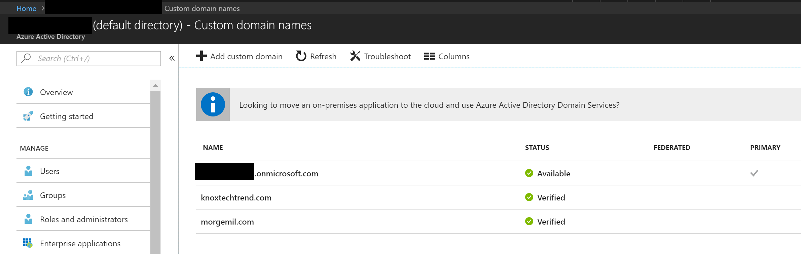
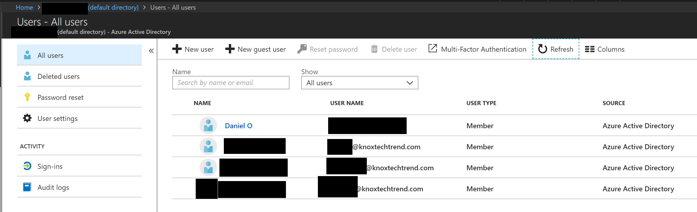
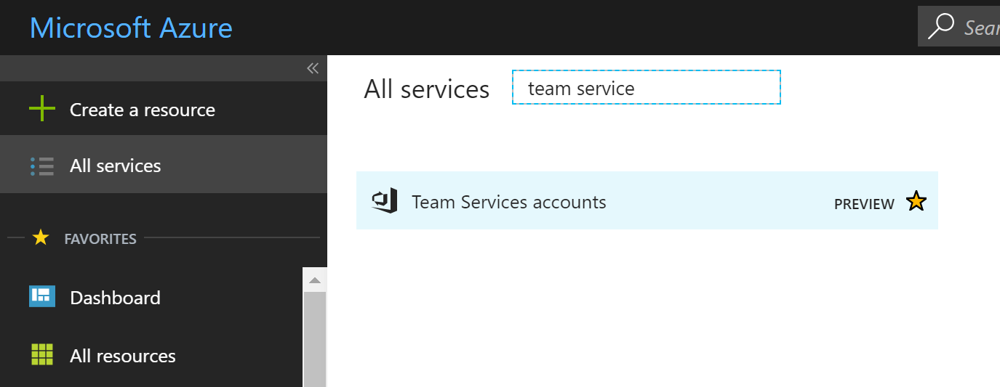
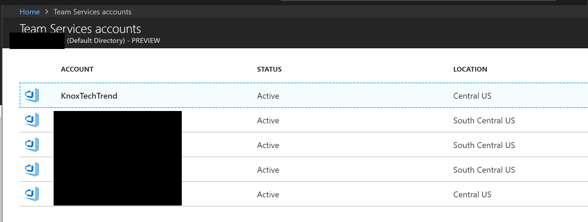
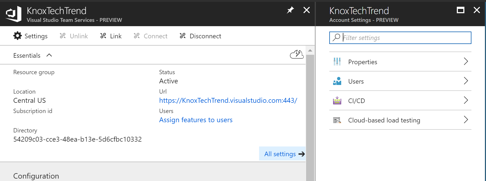
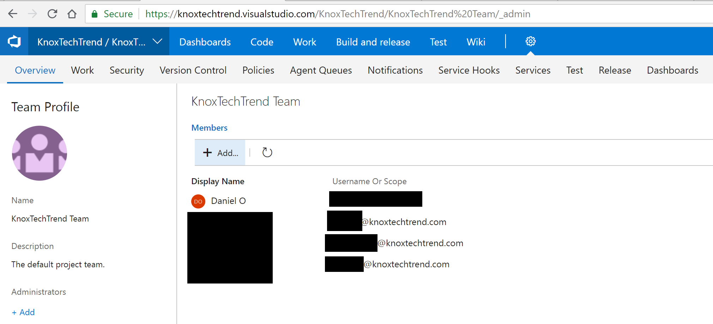

Azure Active Directory makes it easy to add a custom domain.  So I have several here.  It's as simple as adding a single record to DNS.

With these custom domains, I have several users under one of these domains.

## VSTS setup

I have a VSTS project that I want to hook up to this custom domain's logins.

Note that I'm logged into VSTS and Azure with the same account which has owner permissions on both.

Looking under "All Resources" I can find Team Services.

I'm setting up KnoxTechTrend, so I'll pick that from the top of the list.

At the very top, select "Connect" and Team Services will hook up to Azure

Go back to VSTS and add the members.

The users on the custom domain in your Azure Active Directory can now log into VSTS.

## Summary

Azure Active Directory makes a lot of things simple and easy to use.  For a more comprehensive set of steps that takes more possibilities into account, see the [Azure documentation][0].

[0]: https://docs.microsoft.com/en-us/vsts/organizations/accounts/connect-account-to-aad?view=vsts

