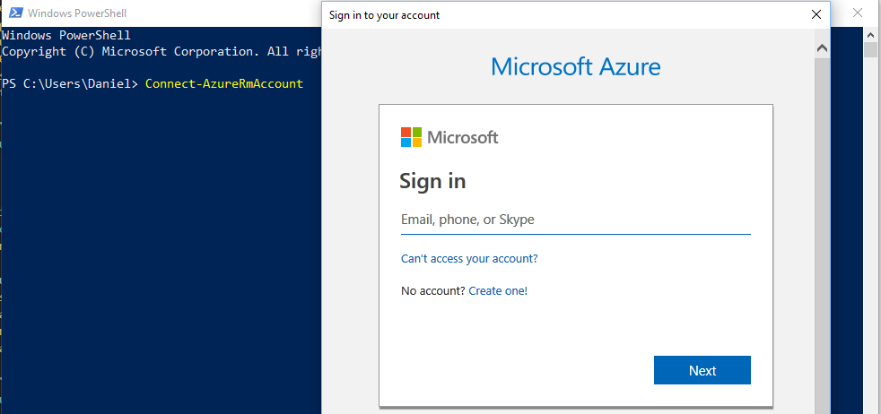
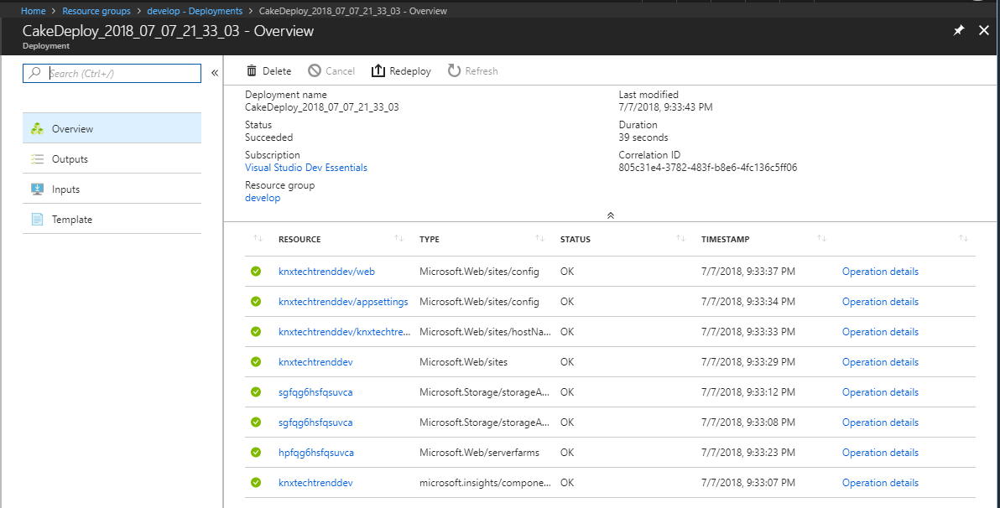
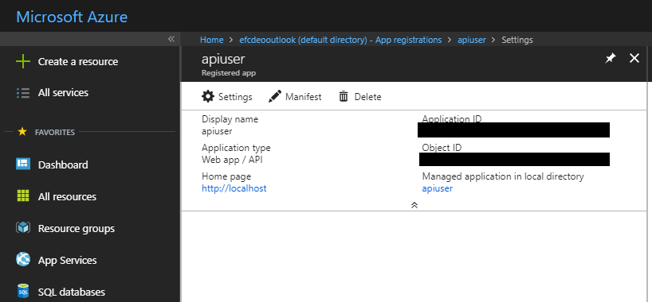
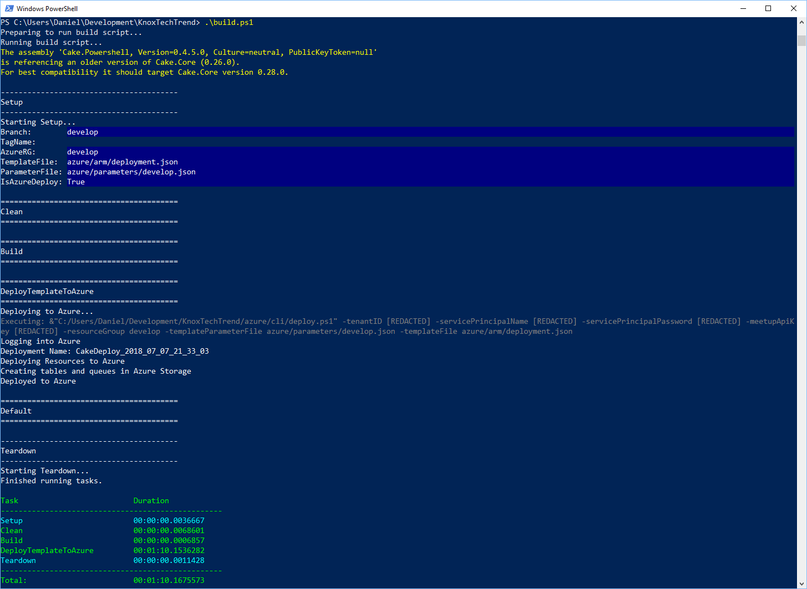
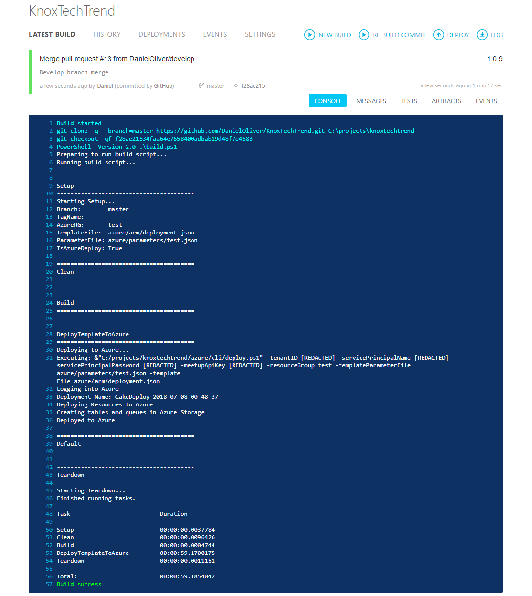

C# Cake is a fantastic build tool that can be used with PowerShell to automate Azure deployments. Below, I'm going to show how I'm automating Azure resource deployment for my project ["Knox Tech Trends"][5].

## Requirements

I'm assuming that [Azure PowerShell is installed][0].

## Azure Resources

The resources I want to deploy to Azure is an Azure Resource Manager (ARM) Template. With this lengthy ARM Template below I can define and deploy these three things.

* Azure Functions App (Consumption plan).
* Azure Storage Account connected to the Azure Functions App.
* Azure App Insights to monitor and analyze the Azure Functions App.
* _However, the resource group must already exist to be deployed to._

```json
{
    "$schema": "https://schema.management.azure.com/schemas/2015-01-01/deploymentTemplate.json#",
    "contentVersion": "1.0.0.0",
    "parameters": {
        "functionAppName": {
            "type": "string",
            "defaultValue": "[concat('tchtrndfnc', resourceGroup().name)]",
            "maxLength": 15,
            "metadata": {
                "description": "The name of the Azure Function App"
            }
        },
        "hostingPlanName": {
            "type": "string",
            "defaultValue": "[concat('hp', uniqueString(resourceGroup().id))]",
            "maxLength": 15,
            "metadata": {
                "description": "The name of the Hosting Plan"
            }
        },
        "storageName": {
            "type": "string",
            "defaultValue": "[concat('sg', uniqueString(resourceGroup().id))]",
            "maxLength": 15,
            "metadata": {
                "description": "The name of the Storage Account"
            }
        },
        "config_web_name": {
            "defaultValue": "web",
            "type": "String"
        },
        "meetup_api_key": {
            "defaultValue": "",
            "type": "String"
        }
    },
    "variables": {
        "functionAppNameBinding": "[concat(parameters('functionAppName'),'.azurewebsites.net')]"
    },
    "resources": [
        {
            "type": "microsoft.insights/components",
            "kind": "web",
            "name": "[parameters('functionAppName')]",
            "apiVersion": "2015-05-01",
            "location": "[resourceGroup().location]",
            "tags": {
                "[concat('hidden-link:/subscriptions/', resourceGroup().id, '/resourceGroups/', parameters('functionAppName'), '/providers/Microsoft.Web/sites/', parameters('functionAppName'))]": "Resource"
            },
            "scale": null,
            "properties": {
                "Application_Type": "web",
                "Flow_Type": null,
                "Request_Source": "IbizaWebAppExtensionCreate",
                "HockeyAppId": null,
                "SamplingPercentage": null
            },
            "dependsOn": []
        },
        {
            "type": "Microsoft.Storage/storageAccounts",
            "sku": {
                "name": "Standard_LRS",
                "tier": "Standard"
            },
            "kind": "Storage",
            "name": "[parameters('storageName')]",
            "apiVersion": "2018-02-01",
            "location": "[resourceGroup().location]",
            "tags": {},
            "scale": null,
            "properties": {
                "networkAcls": {
                    "bypass": "AzureServices",
                    "virtualNetworkRules": [],
                    "ipRules": [],
                    "defaultAction": "Allow"
                },
                "supportsHttpsTrafficOnly": false,
                "encryption": {
                    "services": {
                        "file": {
                            "enabled": true
                        },
                        "blob": {
                            "enabled": true
                        }
                    },
                    "keySource": "Microsoft.Storage"
                }
            },
            "dependsOn": []
        },
        {
            "type": "Microsoft.Web/serverfarms",
            "sku": {
                "name": "Y1",
                "tier": "Dynamic",
                "size": "Y1",
                "family": "Y",
                "capacity": 0
            },
            "kind": "functionapp",
            "name": "[parameters('hostingPlanName')]",
            "apiVersion": "2016-09-01",
            "location": "[resourceGroup().location]",
            "scale": null,
            "properties": {
                "name": "[parameters('hostingPlanName')]",
                "workerTierName": null,
                "adminSiteName": null,
                "hostingEnvironmentProfile": null,
                "perSiteScaling": false,
                "reserved": false,
                "targetWorkerCount": 0,
                "targetWorkerSizeId": 0
            },
            "dependsOn": []
        },
        {
            "type": "Microsoft.Web/sites",
            "kind": "functionapp",
            "name": "[parameters('functionAppName')]",
            "apiVersion": "2016-08-01",
            "location": "[resourceGroup().location]",
            "scale": null,
            "properties": {
                "enabled": true,
                "hostNameSslStates": [
                    {
                        "name": "[concat(parameters('functionAppName'),'.azurewebsites.net')]",
                        "sslState": "Disabled",
                        "virtualIP": null,
                        "thumbprint": null,
                        "toUpdate": null,
                        "hostType": "Standard"
                    },
                    {
                        "name": "[concat(parameters('functionAppName'),'.scm.azurewebsites.net')]",
                        "sslState": "Disabled",
                        "virtualIP": null,
                        "thumbprint": null,
                        "toUpdate": null,
                        "hostType": "Repository"
                    }
                ],
                "serverFarmId": "[resourceId('Microsoft.Web/serverfarms', parameters('hostingPlanName'))]",
                "reserved": false,
                "siteConfig": null,
                "scmSiteAlsoStopped": false,
                "hostingEnvironmentProfile": null,
                "clientAffinityEnabled": false,
                "clientCertEnabled": false,
                "hostNamesDisabled": false,
                "containerSize": 1536,
                "dailyMemoryTimeQuota": 0,
                "cloningInfo": null
            },
            "dependsOn": [
                "[resourceId('Microsoft.Web/serverfarms', parameters('hostingPlanName'))]",
                "[resourceId('microsoft.insights/components', parameters('functionAppName'))]",
                "[resourceId('Microsoft.Storage/storageAccounts', parameters('storageName'))]"
            ],
            "resources": [
                {
                  "apiVersion": "2016-03-01",
                  "name": "appsettings",
                  "type": "config",
                  "dependsOn": [
                    "[resourceId('Microsoft.Web/sites', parameters('functionAppName'))]"
                  ],
                  "properties": {
                    "FUNCTIONS_EXTENSION_VERSION": "~1",
                    "WEBSITE_CONTENTSHARE": "[toLower(parameters('functionAppName'))]",
                    "WEBSITE_NODE_DEFAULT_VERSION": "6.5.0",
                    "WEBSITE_CONTENTAZUREFILECONNECTIONSTRING": "[concat('DefaultEndpointsProtocol=https;AccountName=',parameters('storageName'),';AccountKey=',listKeys(resourceId('Microsoft.Storage/storageAccounts', parameters('storageName')), '2015-05-01-preview').key1)]",
                    "AZURE_STORAGE_CONNECTION_STRING": "[concat('DefaultEndpointsProtocol=https;AccountName=',parameters('storageName'),';AccountKey=',listKeys(resourceId('Microsoft.Storage/storageAccounts', parameters('storageName')), '2015-05-01-preview').key1)]",
                    "WEBSITE_NODE_DEFAULT_VERSION": "6.5.0",
                    "meetup_api_key": "[parameters('meetup_api_key')]",
                    "AppInsights_InstrumentationKey": "[reference(concat('microsoft.insights/components/', parameters('functionAppName'))).InstrumentationKey]",
                    "AzureWebJobsStorage": "[concat('DefaultEndpointsProtocol=https;AccountName=',parameters('storageName'),';AccountKey=',listKeys(resourceId('Microsoft.Storage/storageAccounts', parameters('storageName')), '2015-05-01-preview').key1)]"
                  }
                }
            ]
        },
        {
            "type": "Microsoft.Web/sites/config",
            "name": "[concat(parameters('functionAppName'), '/', parameters('config_web_name'))]",
            "apiVersion": "2016-08-01",
            "location": "[resourceGroup().location]",
            "scale": null,
            "properties": {
                "numberOfWorkers": 1,
                "defaultDocuments": [
                    "Default.htm",
                    "Default.html",
                    "Default.asp",
                    "index.htm",
                    "index.html",
                    "iisstart.htm",
                    "default.aspx",
                    "index.php"
                ],
                "netFrameworkVersion": "v4.0",
                "phpVersion": "5.6",
                "pythonVersion": "",
                "nodeVersion": "",
                "linuxFxVersion": "",
                "windowsFxVersion": null,
                "requestTracingEnabled": false,
                "remoteDebuggingEnabled": false,
                "remoteDebuggingVersion": null,
                "httpLoggingEnabled": false,
                "logsDirectorySizeLimit": 35,
                "detailedErrorLoggingEnabled": false,
                "publishingUsername": "$user3",
                "publishingPassword": null,
                "appSettings": [
                    {
                        "name": "AzureWebJobsDashboard",
                        "value": "[concat('DefaultEndpointsProtocol=https;AccountName=',parameters('storageName'),';AccountKey=',listKeys(resourceId('Microsoft.Storage/storageAccounts', parameters('storageName')), '2015-05-01-preview').key1)]"
                    },
                    {
                        "name": "AzureWebJobsStorage",
                        "value": "[concat('DefaultEndpointsProtocol=https;AccountName=',parameters('storageName'),';AccountKey=',listKeys(resourceId('Microsoft.Storage/storageAccounts', parameters('storageName')), '2015-05-01-preview').key1)]"
                    },
                    {
                        "name": "AZURE_STORAGE_CONNECTION_STRING",
                        "value": "[concat('DefaultEndpointsProtocol=https;AccountName=',parameters('storageName'),';AccountKey=',listKeys(resourceId('Microsoft.Storage/storageAccounts', parameters('storageName')), '2015-05-01-preview').key1)]"
                    },
                    {
                        "name": "FUNCTIONS_EXTENSION_VERSION",
                        "value": "~1"
                    },
                    {
                        "name": "WEBSITE_CONTENTAZUREFILECONNECTIONSTRING",
                        "value": "[concat('DefaultEndpointsProtocol=https;AccountName=',parameters('storageName'),';AccountKey=',listKeys(resourceId('Microsoft.Storage/storageAccounts', parameters('storageName')), '2015-05-01-preview').key1)]"
                    },
                    {
                        "name": "WEBSITE_CONTENTSHARE",
                        "value": "[toLower(parameters('functionAppName'))]"
                    },
                    {
                        "name": "AppInsights_InstrumentationKey",
                        "value": "[reference(concat('microsoft.insights/components/', parameters('functionAppName'))).InstrumentationKey]"
                    },
                    {
                        "name": "WEBSITE_NODE_DEFAULT_VERSION",
                        "value": "6.5.0"
                    },
                    {
                        "name": "meetup_api_key",
                        "value": "[parameters('meetup_api_key')]"
                    }
                ],
                "metadata": null,
                "connectionStrings": null,
                "machineKey": null,
                "handlerMappings": null,
                "documentRoot": null,
                "scmType": "None",
                "use32BitWorkerProcess": true,
                "webSocketsEnabled": false,
                "alwaysOn": false,
                "javaVersion": null,
                "javaContainer": null,
                "javaContainerVersion": null,
                "appCommandLine": "",
                "managedPipelineMode": "Integrated",
                "virtualApplications": [
                    {
                        "virtualPath": "/",
                        "physicalPath": "site\\wwwroot",
                        "preloadEnabled": false,
                        "virtualDirectories": null
                    }
                ],
                "winAuthAdminState": 0,
                "winAuthTenantState": 0,
                "customAppPoolIdentityAdminState": false,
                "customAppPoolIdentityTenantState": false,
                "runtimeADUser": null,
                "runtimeADUserPassword": null,
                "loadBalancing": "LeastRequests",
                "routingRules": [],
                "experiments": {
                    "rampUpRules": []
                },
                "limits": null,
                "autoHealEnabled": false,
                "autoHealRules": null,
                "tracingOptions": null,
                "vnetName": "",
                "siteAuthEnabled": false,
                "siteAuthSettings": {
                    "enabled": null,
                    "unauthenticatedClientAction": null,
                    "tokenStoreEnabled": null,
                    "allowedExternalRedirectUrls": null,
                    "defaultProvider": null,
                    "clientId": null,
                    "clientSecret": null,
                    "issuer": null,
                    "allowedAudiences": null,
                    "additionalLoginParams": null,
                    "isAadAutoProvisioned": false,
                    "googleClientId": null,
                    "googleClientSecret": null,
                    "googleOAuthScopes": null,
                    "facebookAppId": null,
                    "facebookAppSecret": null,
                    "facebookOAuthScopes": null,
                    "twitterConsumerKey": null,
                    "twitterConsumerSecret": null,
                    "microsoftAccountClientId": null,
                    "microsoftAccountClientSecret": null,
                    "microsoftAccountOAuthScopes": null
                },
                "cors": {
                    "allowedOrigins": [
                        "https://functions.azure.com",
                        "https://functions-staging.azure.com",
                        "https://functions-next.azure.com"
                    ]
                },
                "push": null,
                "apiDefinition": null,
                "autoSwapSlotName": null,
                "localMySqlEnabled": false,
                "managedServiceIdentityId": null,
                "xManagedServiceIdentityId": null,
                "ipSecurityRestrictions": null,
                "http20Enabled": false,
                "minTlsVersion": "1.0",
                "ftpsState": "AllAllowed"
            },
            "dependsOn": [
                "[resourceId('Microsoft.Web/sites', parameters('functionAppName'))]"
            ]
        },
        {
            "type": "Microsoft.Web/sites/hostNameBindings",
            "name": "[concat(parameters('functionAppName'), '/', variables('functionAppNameBinding'))]",
            "apiVersion": "2016-08-01",
            "location": "[resourceGroup().location]",
            "scale": null,
            "properties": {
                "siteName": "[parameters('functionAppName')]",
                "domainId": null,
                "hostNameType": "Verified"
            },
            "dependsOn": [
                "[resourceId('Microsoft.Web/sites', parameters('functionAppName'))]"
            ]
        }
    ],
    "outputs": {
        "storageAccountName": {
            "type": "string",
            "value": "[parameters('storageName')]"
        }
    }
}
```

## Deploy by PowerShell

Once I have that above template, I can deploy it via PowerShell with this command.

```powershell
New-AzureRmResourceGroupDeployment -Name firstDeployment -ResourceGroupName develop -TemplateFile deployment.json -Force
```

## Automating deployment

I don't want to login  every-time I try to run the deployment. I need to automate this stuff.



Let's add a way to login to Azure with credentials automatically to run the deployment and then run a few other tasks as well.

The script I ended up with is this. Given service principal credentials and a few defaults, I can deploy the above Azure Resource.

```powershell
param (
    [Parameter()][string]$servicePrincipalName,
    [Parameter()][string]$servicePrincipalPassword,
    [Parameter()][string]$tenantID,
    [Parameter()][string]$resourceGroup = "develop",
    [Parameter()][string]$templateFile = "../arm/deployment.json",
    [Parameter()][string]$templateParameterFile = "../parameters/develop.json",
    [Parameter()][string]$meetupApiKey = ""
)

$securePassword = ConvertTo-SecureString -Force -AsPlainText -String $servicePrincipalPassword
$cred = New-Object -TypeName "System.Management.Automation.PSCredential" ($servicePrincipalName, $securePassword)
Write-Host "Logging into Azure"
$connect = Connect-AzureRmAccount -Credential $cred -ServicePrincipal -TenantId $tenantID
if(!$connect) {
    Write-Error "Failed to login to Azure."
}

$deploymentName = ("CakeDeploy_" + $(get-date -f yyyy_MM_dd) + "_" + $(get-date -f HH_mm_ss))
Write-Host "Deployment Name: $deploymentName"
Write-Host "Deploying Resources to Azure"
New-AzureRmResourceGroupDeployment -Mode Complete -Name $deploymentName -ResourceGroupName $resourceGroup -TemplateFile $templateFile -TemplateParameterFile $templateParameterFile -Force -meetup_api_key $meetupApiKey | Out-Null
$outputs = (Get-AzureRmResourceGroupDeployment -ResourceGroupName $resourceGroup -Name $deploymentName).Outputs

Write-Host "Creating tables and queues in Azure Storage"
$storageName = $outputs.storageAccountName.value
$storageContext = Get-AzureRmStorageAccount -StorageAccountName $storageName -ResourceGroupName $resourceGroup
New-AzureStorageTable -Name "meetup" -Context $storageContext.Context -ErrorAction SilentlyContinue
New-AzureStorageTable -Name "events" -Context $storageContext.Context -ErrorAction SilentlyContinue
New-AzureStorageQueue -Name "meetup-refresh" -Context $storageContext.Context -ErrorAction SilentlyContinue
New-AzureStorageQueue -Name "meetup-add-details" -Context $storageContext.Context -ErrorAction SilentlyContinue
```

What's happening here is that I am:

1. Creating credentials object manually.
2. Logging into Azure.
3. Creating an Azure deployment.
4. Getting the output variables of the deployment.
5. Using the storage name from an output variable, to make sure 2 tables and 2 queues are created.




## Credentials

If you notice, I'm saying "Service Principal" Name/Password.  _Not my username and password._

I have here a very minimal script to create an Azure Service Principal based on an application, and then assign an Azure Contributor role.

```powershell
param (
    [Parameter(Mandatory=$true)][string]$displayName,
    [Parameter(Mandatory=$true)][string]$password,
    [Parameter()][string]$identifierUri = "http://localhost"
    )

$app = Get-AzureRmADApplication -IdentifierUri $identifierUri
if(!$app) {
    Add-Type -Assembly System.Web
    $securePassword = ConvertTo-SecureString -Force -AsPlainText -String $password
    $app = New-AzureRmADApplication -DisplayName "apiuser" -HomePage $identifierUri -IdentifierUris $identifierUri -Password $securePassword
    $principal = New-AzureRmADServicePrincipal -ApplicationId $app.ApplicationId
    New-AzureRmRoleAssignment -RoleDefinitionName Contributor -ServicePrincipalName "$($principal.ServicePrincipalNames[0])"
} else {
    Write-Host "Application with identifying URI already exists."
}
```

When I supply the three parameters and run the script, I can go into Azure Active Directory under App registrations and see the new application.  Note that I'm using password authentication, but a [certificate is never a bad idea.][1]



Now I can use the first script and supply these three parameters.  (The Tenant ID is the Azure Active Directory ID.)

```powershell
    [Parameter()][string]$servicePrincipalName,
    [Parameter()][string]$servicePrincipalPassword,
    [Parameter()][string]$tenantID,
```

## C# Cake Build

It's not necessary that I run this via a C# Cake Build script, but things I'm adding in further blog posts will make it very helpful. So let's start with [C# Cake Build][2].

Cake is just a handy way to make a build script in C#.  Here's the script I built.

```csharp
#addin nuget:?package=Cake.Powershell&version=0.4.5
//////////////////////////////////////////////////////////////////////
// ARGUMENTS
//////////////////////////////////////////////////////////////////////

var target = Argument("target", "Default");
var configuration = Argument("configuration", "Release");

var meetupApiKey = Argument("MEETUP_API_KEY", EnvironmentVariable("MEETUP_API_KEY"));
var tenantID = Argument("TENANT_ID", EnvironmentVariable("TENANT_ID"));
var servicePrincipalName = Argument("SERVICE_PRINCIPAL_NAME", EnvironmentVariable("SERVICE_PRINCIPAL_NAME"));
var servicePrincipalPassword = Argument("SERVICE_PRINCIPAL_PASSWORD", EnvironmentVariable("SERVICE_PRINCIPAL_PASSWORD"));

var branch = EnvironmentVariable("APPVEYOR_REPO_BRANCH") ?? "";
var isMasterBranch = branch.ToUpper().Contains("MASTER");
var isDevelopBranch = branch.ToUpper().Contains("DEVELOP");
var isTagged = (EnvironmentVariable("APPVEYOR_REPO_TAG") ?? "").Contains("true");
var tagName = EnvironmentVariable("APPVEYOR_REPO_TAG_NAME") ?? "";

var resourceGroupName = Argument("RESOURCE_GROUP_NAME", EnvironmentVariable("RESOURCE_GROUP_NAME"));
if(resourceGroupName == null) {
    if(isMasterBranch && isTagged) {
        resourceGroupName = "production";
    } else if (isMasterBranch) {
        resourceGroupName = "test";
    } else if (isDevelopBranch) {
        resourceGroupName = "develop";
    }
}

var templateFile = "azure/arm/deployment.json";
var parameterFileName = Argument("PARAMETER_FILE_NAME", EnvironmentVariable("PARAMETER_FILE_NAME"));
if(parameterFileName == null && resourceGroupName != null) {
    parameterFileName = $"azure/parameters/{resourceGroupName}.json";
}
var shouldDeployToAzure = !string.IsNullOrWhiteSpace(resourceGroupName) && !string.IsNullOrWhiteSpace(parameterFileName);

//////////////////////////////////////////////////////////////////////
// PREPARATION
//////////////////////////////////////////////////////////////////////

// Define directories.
var buildDir = Directory("./build") + Directory(configuration);


///////////////////////////////////////////////////////////////////////////////
// SETUP / TEARDOWN
///////////////////////////////////////////////////////////////////////////////

Setup(context => {
    Information("Starting Setup...");

    Information("Branch:        {0}", branch);
    Information("TagName:       {0}", tagName);
    Information("AzureRG:       {0}", resourceGroupName);
    Information("TemplateFile:  {0}", templateFile);
    Information("ParameterFile: {0}", parameterFileName);
    Information("IsAzureDeploy: {0}", shouldDeployToAzure);

});

Teardown(context => {
    Information("Starting Teardown...");
    Information("Finished running tasks.");
});

//////////////////////////////////////////////////////////////////////
// TASKS
//////////////////////////////////////////////////////////////////////

Task("Clean")
    .Does(() =>
{
    CleanDirectory(buildDir);
});

Task("Build")
    .IsDependentOn("Clean")
    .Does(() =>
{

});

Task("DeployTemplateToAzure")
    .WithCriteria(() => shouldDeployToAzure)
    .IsDependentOn("Build")
    .Does(() =>
{
    Information("Deploying to Azure...");
    StartPowershellFile("azure/cli/deploy.ps1", new PowershellSettings()
        .WithArguments(args =>
        {
            args.AppendSecret("tenantID", tenantID)
                .AppendSecret("servicePrincipalName", servicePrincipalName)
                .AppendSecret("servicePrincipalPassword", servicePrincipalPassword)
                .AppendSecret("meetupApiKey", meetupApiKey)
                .Append("resourceGroup", resourceGroupName)
                .Append("templateParameterFile", parameterFileName)
                .Append("templateFile", templateFile);
        }));
    Information("Deployed to Azure");
});

//////////////////////////////////////////////////////////////////////
// TASK TARGETS
//////////////////////////////////////////////////////////////////////

Task("Default")
    .IsDependentOn("DeployTemplateToAzure")
    .IsDependentOn("Build");

//////////////////////////////////////////////////////////////////////
// EXECUTION
//////////////////////////////////////////////////////////////////////

RunTarget(target);
```

<br/>

This C# code defines the arguments, where it may get them from, and then does a list of tasks (but only one task so far).

Additionally, this script looks at multiple variables and figures out which environment (Azure Resource Group) to deploy to, which file contains template variables, then adds more secret parameters, and finally calls the PowerShell script far above to deploy.

I can run this from my local environment of mine own computer.



And finally, I can automate it with AppVeyor.



## Summary

If I still have work to do, I haven't automated enough. If I can explain how to do something, it can be automated. If I can't explain how to do something, I can't repeatably do that thing.

[My code is here.][3]

[AppVeyor build is here.][4] 

[0]: https://docs.microsoft.com/en-us/powershell/azure/install-azurerm-ps?view=azurermps-6.4.0
[1]: https://docs.microsoft.com/en-us/azure/azure-resource-manager/resource-group-authenticate-service-principal
[2]: https://cakebuild.net/
[3]: https://github.com/DanielOliver/KnoxTechTrend/tree/f28ae21534faa64e7658400adbab19d48f7e4583/
[4]: https://ci.appveyor.com/project/DanielOliver/knoxtechtrend
[5]: https://github.com/DanielOliver/KnoxTechTrend
