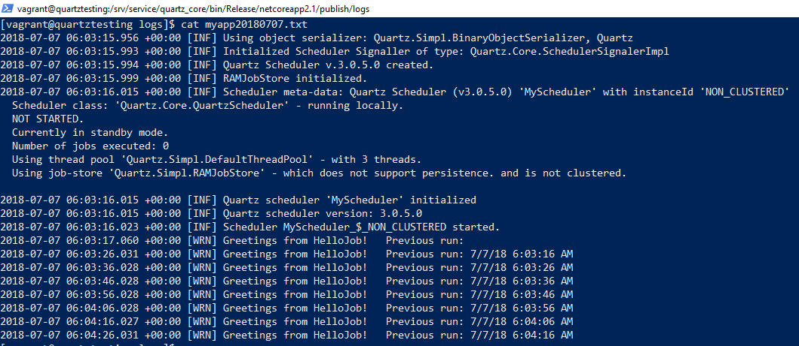

Two weeks ago I start with this topic: [Scheduling with Quartz .NET Scheduler and Topshelf service using Serilog][0], in which I created a Windows service.

Now two things you might have noticed is that I was using a Windows-specific version of .NET and that I wasn't using Quartz.Topshelf.Integration.  I defined the Quartz .NET scheduler in an entirely different file for a purpose, so that I could break it out into its own project and use it elsewhere.

I have broken the Quartz .NET scheduler out into a separate project and called it "quartz_service", but there's no change to those files from before.  They just point at "netstandard2.0" now.

```csharp
public class ScheduleService
{
    private readonly IScheduler scheduler;

    public ScheduleService()
    {
        NameValueCollection props = new NameValueCollection
        {
            { "quartz.serializer.type", "binary" },
            { "quartz.scheduler.instanceName", "MyScheduler" },
            { "quartz.jobStore.type", "Quartz.Simpl.RAMJobStore, Quartz" },
            { "quartz.threadPool.threadCount", "3" }
        };
        StdSchedulerFactory factory = new StdSchedulerFactory(props);
        scheduler = factory.GetScheduler().ConfigureAwait(false).GetAwaiter().GetResult();
    }
    public void Start()
    {
        scheduler.Start().ConfigureAwait(false).GetAwaiter().GetResult();

        ScheduleJobs();
    }
    public void ScheduleJobs()
    {
        IJobDetail job = JobBuilder.Create<HelloJob>()
            .WithIdentity("job1", "group1")
            .Build();

        ITrigger trigger = TriggerBuilder.Create()
            .WithIdentity("trigger1", "group1")
            .StartNow()
            .WithSimpleSchedule(x => x
                .WithIntervalInSeconds(10)
                .RepeatForever())
            .Build();

        // Tell quartz to schedule the job using our trigger
        scheduler.ScheduleJob(job, trigger).ConfigureAwait(false).GetAwaiter().GetResult();
    }
    public void Stop()
    {
        scheduler.Shutdown().ConfigureAwait(false).GetAwaiter().GetResult();
    }
}
```

<br/>

This is the basic job that's scheduled by the above class.

```csharp
public class HelloJob : IJob
{
    public Task Execute(IJobExecutionContext context)
    {
        var lastRun = context.PreviousFireTimeUtc?.DateTime.ToString() ?? string.Empty;
        Log.Warning("Greetings from HelloJob!   Previous run: {lastRun}", lastRun);
        return Task.CompletedTask;
    }
}
```

My existing Topshelf console application hasn't changed at all either.

## .NET Core Console

My next steps are to create a new .NET Core console application that will run forever, but still gracefully shut down. Here is the code for Program.cs.

```csharp
class Program
{
    private static ScheduleService _service;

    static void Main(string[] args)
    {
        Log.Logger = new LoggerConfiguration()
            .MinimumLevel.Information()
            .WriteTo.File($"logs/myapp.txt", rollingInterval: RollingInterval.Day)
            .CreateLogger();

        _service = new ScheduleService();
        _service.Start();

        AssemblyLoadContext.Default.Unloading += SigTermEventHandler;
        Console.CancelKeyPress += CancelHandler;

        while (true) {
            System.Console.Read();
        };
    }
    private static void SigTermEventHandler(AssemblyLoadContext obj)
    {
        Log.Information("Unloading...");
        _service.Stop();
    }
    private static void CancelHandler(object sender, ConsoleCancelEventArgs e)
    {
        Log.Information("Exiting...");
        _service.Stop();
    }
}
```

Now there's a few things I have to explain here.

* "Log.Logger" is a Serilog logging sink that writes to a file.
* "Console.CancelKeyPress" event allows a cancel from the console to be gracefully handled.
* "AssemblyLoadContext.Default.Unloading" is to handle "SIGTERM" which is a _[generic signal used to cause program termination][1]_.
* This program never terminates of its own free volition.

Otherwise, the SchedulerService is the exact same code that the Topshelf application for Windows is running. The difference is that this .NET Core Console application can run on Linux too.

The problem is that this application is no longer a service.

## systemd

[Enter systemd][5] which, among its many useful capabilities, can start services or daemons.

A super simple example definition of a service could look like this.  This definition says what command to start and where the working directory is.

```ini
[Unit]
Description=.NET Core quartz job runner

[Service]
ExecStart=/bin/dotnet /srv/service/quartz_core/bin/Release/netcoreapp2.1/publish/quartz_core.dll
WorkingDirectory=/srv/service/quartz_core/bin/Release/netcoreapp2.1/publish
```

<br/>

> /srv/service/quartz_core/bin/Release/netcoreapp2.1/publish

If you're wondering about this particular directory, it's because I'm running this inside of Vagrant on my Windows 10 machine.

My Vagrantfile here defines a point to mount the code folder to, and a few commands to run when Vagrant boots up.

```ruby
Vagrant.configure("2") do |config|
  config.vm.box = "centos/7"
  config.vm.hostname = "quartztesting"
  config.vm.synced_folder "src/", "/srv/service", type: "virtualbox"
  config.vm.provision "shell", inline: <<-SHELL
    sudo rpm -Uvh https://packages.microsoft.com/config/rhel/7/packages-microsoft-prod.rpm
    sudo yum -y update
    sudo yum -y install dotnet-sdk-2.1
    cd /srv/service/quartz_core
    dotnet publish -c Release
    cp /srv/service/systemd/quartz.service /etc/systemd/system/quartz.service
    sudo systemctl daemon-reload
    sudo systemctl start quartz.service
    sudo systemctl status quartz.service
  SHELL
end
```

The relevant bit is this where I copy the service file to [roughly where it's supposed to be][6], and then reload the daemons.

```bash
cp /srv/service/systemd/quartz.service /etc/systemd/system/quartz.service
sudo systemctl daemon-reload
sudo systemctl start quartz.service
sudo systemctl status quartz.service
```

When it's loaded up, I can run this command to get the status.

```bash
$ systemctl status quartz.service
● quartz.service - .NET Core quartz job runner
   Loaded: loaded (/etc/systemd/system/quartz.service; static; vendor preset: disabled)
   Active: active (running) since Sat 2018-07-07 05:27:12 UTC; 34min ago
 Main PID: 12533 (dotnet)
   CGroup: /system.slice/quartz.service
           └─12533 /bin/dotnet /srv/service/quartz_core/bin/Release/netcoreapp2.1/publish/quartz_core.dll
```

The working directory in above file is relevant, so that I can go find the log files.



## Summary

.NET Core being available to write Linux applications in is very exciting.  The vast power and options available are barely touched upon, and there's so much more that can be done here to secure, to future-proof, and to customize.  I hope the concepts shown here are a kickstarter for new ideas and new work to be done: one code base with lots of reuse for running the same services on Windows and Linux.

References:

* [Logan Paschke][2]
* [Redhat blog][3]
* [RHEL systemd user][4]

[0]: /2018-06-29-quartz
[1]: https://www.gnu.org/software/libc/manual/html_node/Termination-Signals.html
[2]: https://logankpaschke.com/linux/systemd/dotnet/systemd-dotnet-1/
[3]: https://developers.redhat.com/blog/2017/06/07/writing-a-linux-daemon-in-c/
[4]: https://bugs.centos.org/view.php?id=8767
[5]: https://www.freedesktop.org/wiki/Software/systemd/
[6]: https://www.digitalocean.com/community/tutorials/understanding-systemd-units-and-unit-files
