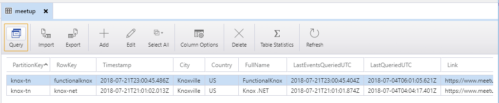
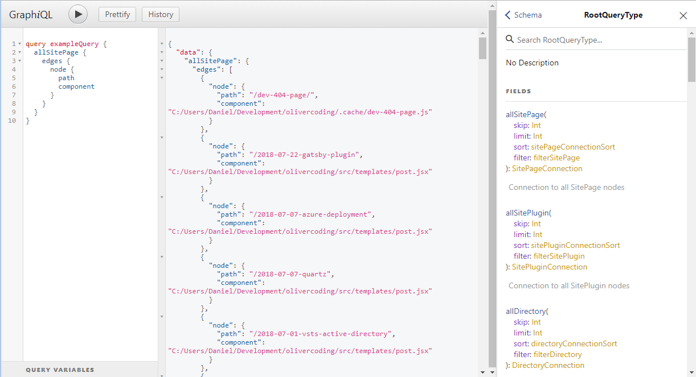
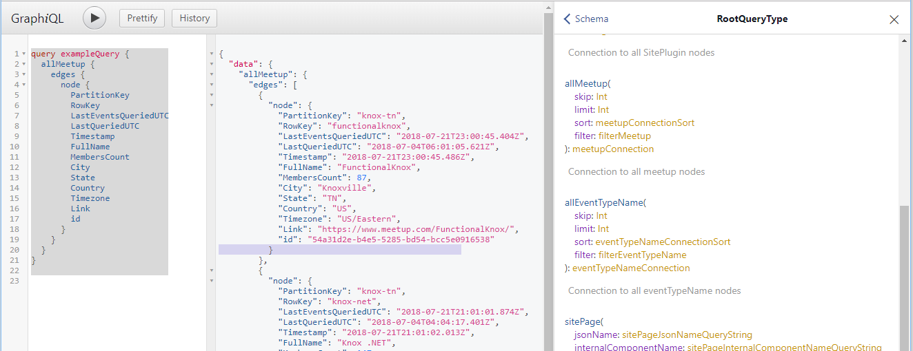

GatsbyJS has type inference that works well with GraphQL. And creating a source plugin for GatsbyJS is the best way to get data into GatsbyJS.  Azure Table Storage is an excellent, but limited, NoSQL table option. I'm going to show how I got data out of Azure Table Storage into GatsbyJS.

## Table Storage

I have a set of tables that contain data for local technology meetups. An example of one of these tables is below.



The best way to get data from Azure Table Storage with Javascript, is to use the [Azure-Storage-Node][0] API. Their canonical example being this:

```javascript
var azure = require('azure-storage');
var tableService = azure.createTableService();
var query = new azure.TableQuery()
  .top(5)
  .where('PartitionKey eq ?', 'part2');

tableService.queryEntities('mytable', query, null, function(error, result, response) {
  if (!error) {
    // result.entries contains entities matching the query
  }
});
```

## GatsbyJS GraphQL

GraphQL is one of GatsbyJS's defining virtues. Being able to query data with GraphQL allows page generation and all sorts of other static site capabilities to be as painless as possible.



## Plugin

Writing a custom source plugin is a good way to make the sourcing of this data as reproducible as possible.  I wrote one that encompasses the above Azure Table Storage library, and creates GatsbyJS GraphQL nodes. Here's the code:

```javascript
const crypto = require("crypto");
var azure = require('azure-storage');

exports.sourceNodes = (
  { actions, createNodeId },
  configOptions
) => {
  const { createNode } = actions

  // Gatsby adds a configOption that's not needed for this plugin, delete it
  delete configOptions.plugins

  if (configOptions.tables == null || !Array.isArray(configOptions.tables)) {
    console.warn("Expected array of tables.")
    return null
  }

  var tableSvc = azure.createTableService()

  const getValueWithDefault = (valueItem, defaultValue) => { return ((valueItem || { _: defaultValue })._ || defaultValue) }
  const getValue = valueItem => getValueWithDefault(valueItem, null)

  function makeNodesFromQuery(tableName, typeName) {
    return new Promise(function (resolve, reject) {
      const query = new azure.TableQuery()
      tableSvc.queryEntities(tableName, query, null, function (error, result, response) {
        if (!error) {
          result.entries.forEach(value => {
            const item = Object.entries(value).reduce((o, prop) => ({ ...o, [prop[0]]: getValue(prop[1]) }), {})
            const nodeId = createNodeId(`${item.PartitionKey}/${item.RowKey}`)
            const nodeContent = JSON.stringify(item)
            const nodeContentDigest = crypto
              .createHash('md5')
              .update(nodeContent)
              .digest('hex')
            const nodeData = Object.assign(item, {
              id: nodeId,
              parent: null,
              children: [],
              internal: {
                type: typeName,
                content: nodeContent,
                contentDigest: nodeContentDigest,
              },
            })
            createNode(nodeData)
          })
          if (result.continuationToken != null) {
            response.continuationToken = result.continuationToken
          }
          resolve()
        } else {
          reject(error)
        }
      })
    })
  }
  return Promise.all(configOptions.tables.map(x => makeNodesFromQuery(x.name, (x.type || x.name))))
}
```

<br/>

The configuration being passed in looks like this, as well as also the environment variables for the Azure Table Storage call.

```javascript
{
 tables: [
    {
      name: "meetup"
    },
    {
      name: "events",
      type: "eventTypeName"
    }
  ]
}
```

<br/>

The key point is the function "createNode" that creates a GraphQL node.

> createNode

Once a node has been created, the sum of those nodes may be queried against.

```graphql
query exampleQuery {
  allMeetup {
    edges {
      node {
        PartitionKey
        RowKey
        LastEventsQueriedUTC
        LastQueriedUTC
        Timestamp
        FullName
        MembersCount
        City
        State
        Country
        Timezone
        Link
        id  
      }
    }
  }
}
```



## Summary

[The code is also here.][1]

GatsbyJS is a very good static site generator that benefits from ease of data integration.

[0]: https://github.com/Azure/azure-storage-node
[1]: https://github.com/DanielOliver/gatsby-source-azure-storage
