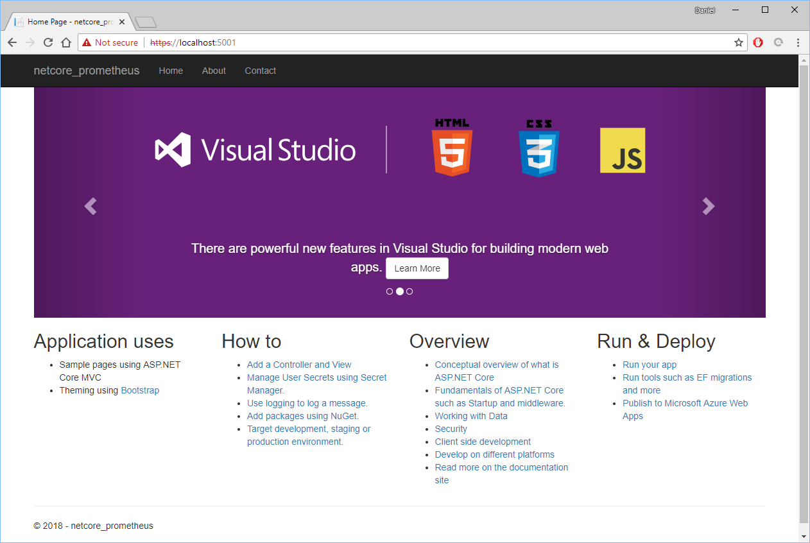
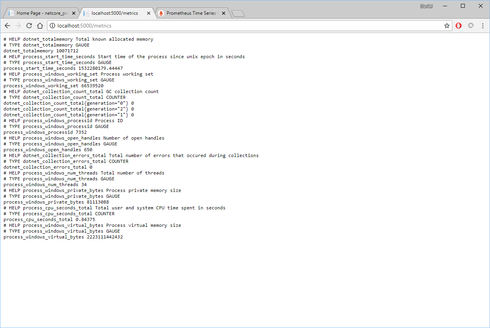
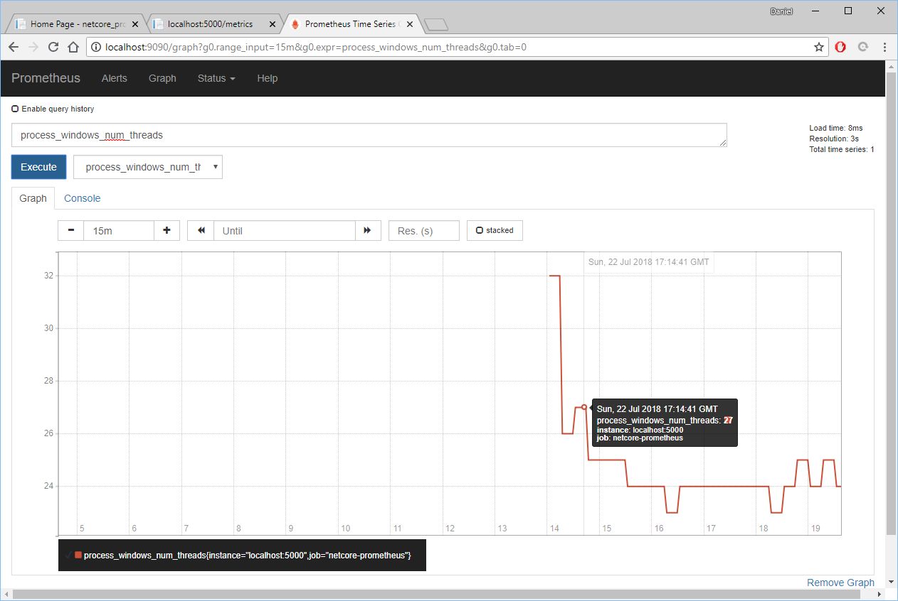
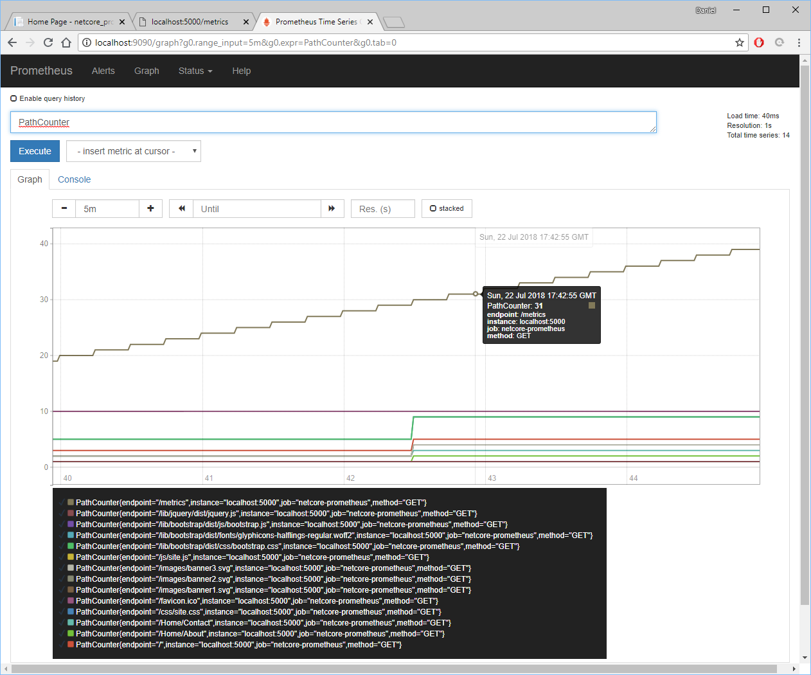
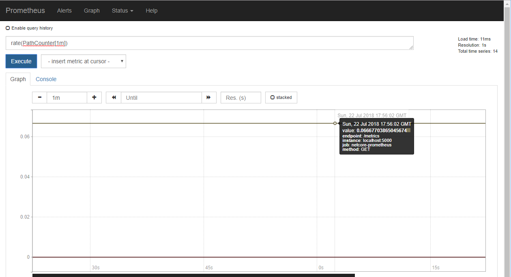

ASP.NET Core is a most convenient and performant set of libraries that I find a pleasure to work with. To compliment any web framework, or any kind of project, I like to have monitoring of metrics. Using these metrics I can more easily measure usage, performance, and diagnose any problems, not to mention I just like pretty graphs confirming I'm doing something right.

Today, I'm using [Prometheus][1] to measure some metrics, and I'll start with an empty .NET Core MVC project and add some metrics.

## New Project

I'm using .NET Core 2.1.302 to create a new MVC project named "netcore-prometheus".

```powershell
dotnet new mvc -o netcore-prometheus
```

<br/>

```powershell
PS C:\Users\Daniel\Development> dotnet --version
2.1.302
PS C:\Users\Daniel\Development> dotnet new mvc -o netcore-prometheus
The template "ASP.NET Core Web App (Model-View-Controller)" was created successfully.
This template contains technologies from parties other than Microsoft, see https://aka.ms/aspnetcore-template-3pn-210 for details.

Processing post-creation actions...
Running 'dotnet restore' on netcore-prometheus\netcore-prometheus.csproj...
  Restoring packages for C:\Users\Daniel\Development\netcore-prometheus\netcore-prometheus.csproj...
  Generating MSBuild file C:\Users\Daniel\Development\netcore-prometheus\obj\netcore-prometheus.csproj.nuget.g.props.
  Generating MSBuild file C:\Users\Daniel\Development\netcore-prometheus\obj\netcore-prometheus.csproj.nuget.g.targets.
  Restore completed in 3.12 sec for C:\Users\Daniel\Development\netcore-prometheus\netcore-prometheus.csproj.

Restore succeeded.
```



## Prometheus .NET Client

An [unofficial Prometheus .NET client][0] exists and I'm adding it to the new project's dependencies with the specialized version for .NET Core: [Prometheus .NET Core Middleware package][2].

```powershell
dotnet add package prometheus-net.AspNetCore
```

<br/>

In _Startup.cs_, add a using statement, and the ASP.NET Middleware.

```csharp
...
using Prometheus;
...
        public void Configure(IApplicationBuilder app, IHostingEnvironment env)
        {
            app.UseMetricServer();
            ...
        }
...
```

<br/>

When I then run the project, I'll see that the .NET Core is exposing a new endpoint for metrics.

```powershell
dotnet run
```



<br/>

So far, these are standard metrics exposed and no custom ones yet. I'll come back to custom metrics.

## Starting Prometheus

Running prometheus is simple to start.

Go [download][3] and extract Prometheus to some directory.

Inside that directory is a file named _prometheus.yml_ which has some default rules.  Replace the contents of that file with this.  (Assuming .NET Core is serving up on port 5000.)

```yaml
global:
  scrape_interval:     15s # Set the scrape interval to every 15 seconds. Default is every 1 minute.
  evaluation_interval: 15s # Evaluate rules every 15 seconds. The default is every 1 minute.
  
scrape_configs:
  - job_name: 'netcore-prometheus'
    # metrics_path defaults to '/metrics'
    static_configs:
    - targets: ['localhost:5000']
```

<br/>

Make sure that your .NET Core MVC project is running, and then start up Prometheus.

```powershell
PS C:\Users\Daniel\Downloads\prometheus-2.3.2.windows-amd64> .\prometheus.exe
level=info ts=2018-07-22T17:13:54.5013457Z caller=main.go:222 msg="Starting Prometheus" version="(version=2.3.2, branch=HEAD, revision=71af5e29e815795e9dd14742ee7725682fa14b7b)"
level=info ts=2018-07-22T17:13:54.5013457Z caller=main.go:223 build_context="(go=go1.10.3, user=root@5258e0bd9cc1, date=20180712-14:13:08)"
level=info ts=2018-07-22T17:13:54.5023319Z caller=main.go:224 host_details=(windows)
level=info ts=2018-07-22T17:13:54.5023319Z caller=main.go:225 fd_limits=N/A
level=info ts=2018-07-22T17:13:54.5023319Z caller=web.go:415 component=web msg="Start listening for connections" address=0.0.0.0:9090
level=info ts=2018-07-22T17:13:54.5023319Z caller=main.go:533 msg="Starting TSDB ..."
level=info ts=2018-07-22T17:13:54.5063459Z caller=main.go:543 msg="TSDB started"
level=info ts=2018-07-22T17:13:54.5063459Z caller=main.go:603 msg="Loading configuration file" filename=prometheus.yml
level=info ts=2018-07-22T17:13:54.5063459Z caller=main.go:629 msg="Completed loading of configuration file" filename=prometheus.yml
level=info ts=2018-07-22T17:13:54.5063459Z caller=main.go:502 msg="Server is ready to receive web requests."
```

<br/>

Wait a couple minutes to give Prometheus a chance to get some data, and then open up _http://localhost:9090_, to give a ready-to-go URL: http://localhost:9090/graph?g0.range_input=15m&g0.expr=process_windows_num_threads&g0.tab=0.



I now have a set of metrics that I can examine.

## Custom Metrics

Now let's jump in and add some custom metrics. Let's start by adding an ASP.NET Core Middleware function to _Startup.cs_.  This counts the requests for each endpoint and the method.

```csharp
        public void Configure(IApplicationBuilder app, IHostingEnvironment env)
        {
            var counter = Metrics.CreateCounter("PathCounter", "Counts requests to endpoints", new CounterConfiguration
            {
                LabelNames = new[] { "method", "endpoint" }
            });
            app.Use((context, next) =>
            {
                counter.WithLabels(context.Request.Method, context.Request.Path).Inc();
                return next();
            });
            ...
        }
```

<br/>

Start the application with the new changes, click around on the page some, and then reload Prometheus http://localhost:9090/graph?g0.range_input=5m&g0.expr=PathCounter&g0.tab=0.



The metrics endpoint keeps incrementing because Prometheus is pulling data from it at 15 second intervals, as configured in _prometheus.yml_ above.

To get a clearer picture of how often the pages are being called, I can enter an expression such as "rate(PathCounter[1m])" to see the rate of this counter.



Looking at the counter, I can see that the metrics endpoint is remaining steady at about "0.67...", which for this metric means "calls-per-second".  This fits the 15 second monitoring intervals.

## Metric Types

[Prometheus has four main metric types available][4]. Knowing when to choose which is a topic of itself that completely depends upon your data and reporting needs. Just be sure to not try to force data into one type, without investigating if another type is a better fit.

* Counter
* Gauge
* Summary
* Histogram

## Summary

Monitoring is a vital piece of any software environment. Without metrics, software maintenance is just hope and faith that something improved.

The next steps from here would be to add some security and to add Grafana.

## Code

_netcore-prometheus.csproj_

```xml
<Project Sdk="Microsoft.NET.Sdk.Web">
  <PropertyGroup>
    <TargetFramework>netcoreapp2.1</TargetFramework>
  </PropertyGroup>
  <ItemGroup>
    <PackageReference Include="Microsoft.AspNetCore.App" />
    <PackageReference Include="prometheus-net.AspNetCore" Version="2.1.0" />
  </ItemGroup>
</Project>
```

_Startup.cs_

```csharp
using System;
using System.Collections.Generic;
using System.Linq;
using System.Threading.Tasks;
using Microsoft.AspNetCore.Builder;
using Microsoft.AspNetCore.Hosting;
using Microsoft.AspNetCore.Http;
using Microsoft.AspNetCore.HttpsPolicy;
using Microsoft.AspNetCore.Mvc;
using Microsoft.Extensions.Configuration;
using Microsoft.Extensions.DependencyInjection;
using Prometheus;

namespace netcore_prometheus
{
    public class Startup
    {
        public Startup(IConfiguration configuration)
        {
            Configuration = configuration;
        }

        public IConfiguration Configuration { get; }

        // This method gets called by the runtime. Use this method to add services to the container.
        public void ConfigureServices(IServiceCollection services)
        {
            services.Configure<CookiePolicyOptions>(options =>
            {
                // This lambda determines whether user consent for non-essential cookies is needed for a given request.
                options.CheckConsentNeeded = context => true;
                options.MinimumSameSitePolicy = SameSiteMode.None;
            });

            services.AddMvc().SetCompatibilityVersion(CompatibilityVersion.Version_2_1);
        }

        // This method gets called by the runtime. Use this method to configure the HTTP request pipeline.
        public void Configure(IApplicationBuilder app, IHostingEnvironment env)
        {
            var counter = Metrics.CreateCounter("PathCounter", "Counts requests to endpoints", new CounterConfiguration
            {
                LabelNames = new[] { "method", "endpoint" }
            });
            app.Use((context, next) =>
            {
                counter.WithLabels(context.Request.Method, context.Request.Path).Inc();
                return next();
            });

            app.UseMetricServer();

            if (env.IsDevelopment())
            {
                app.UseDeveloperExceptionPage();
            }
            else
            {
                app.UseExceptionHandler("/Home/Error");
                app.UseHsts();
            }

            app.UseHttpsRedirection();
            app.UseStaticFiles();
            app.UseCookiePolicy();

            app.UseMvc(routes =>
            {
                routes.MapRoute(
                    name: "default",
                    template: "{controller=Home}/{action=Index}/{id?}");
            });
        }
    }
}
```

[0]: https://github.com/prometheus-net/prometheus-net
[1]: https://prometheus.io/
[2]: https://www.nuget.org/packages/prometheus-net.AspNetCore
[3]: https://prometheus.io/download/
[4]: https://prometheus.io/docs/concepts/metric_types/
