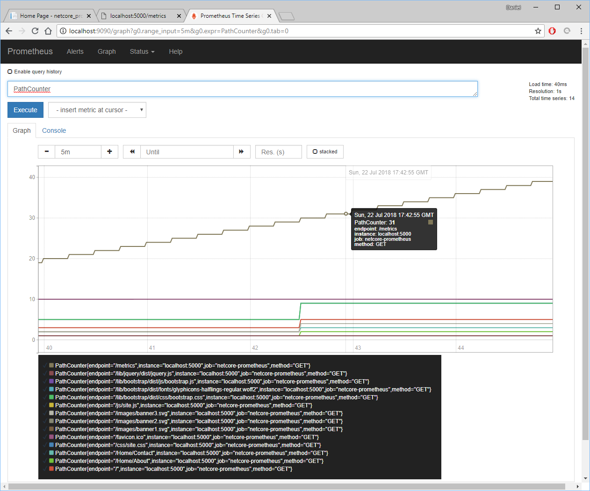
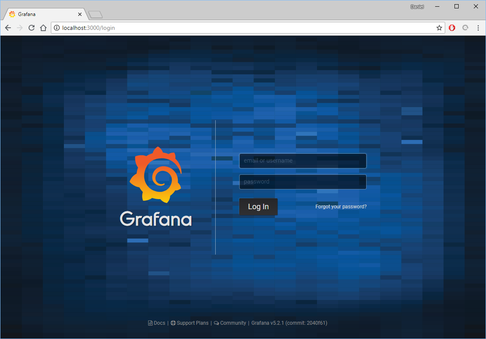
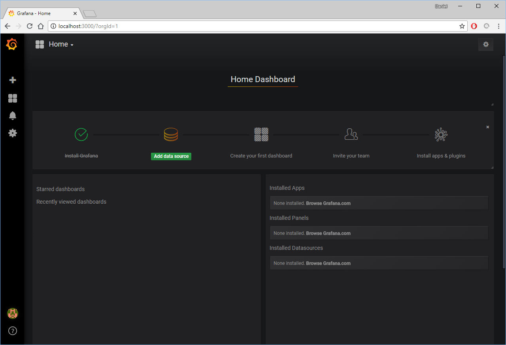
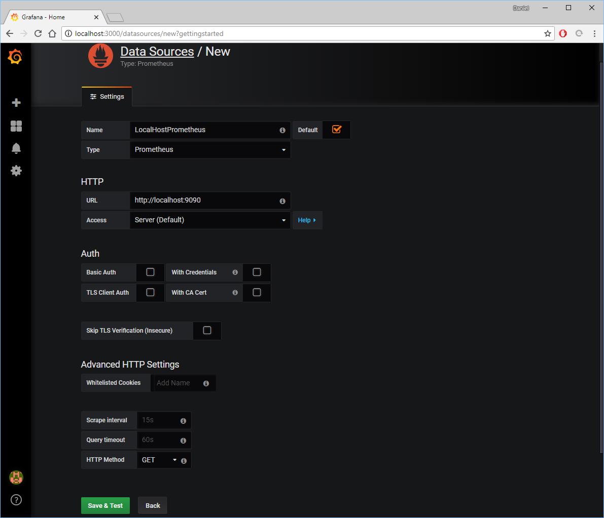
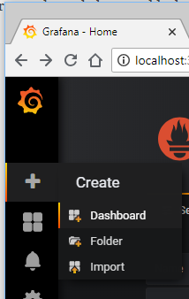
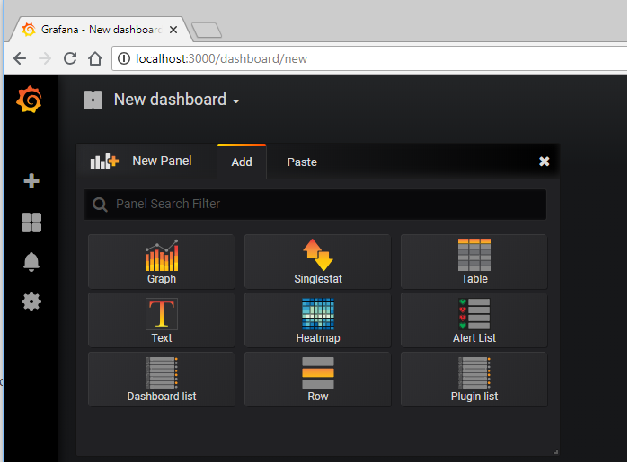
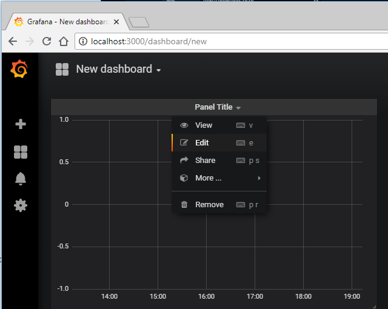
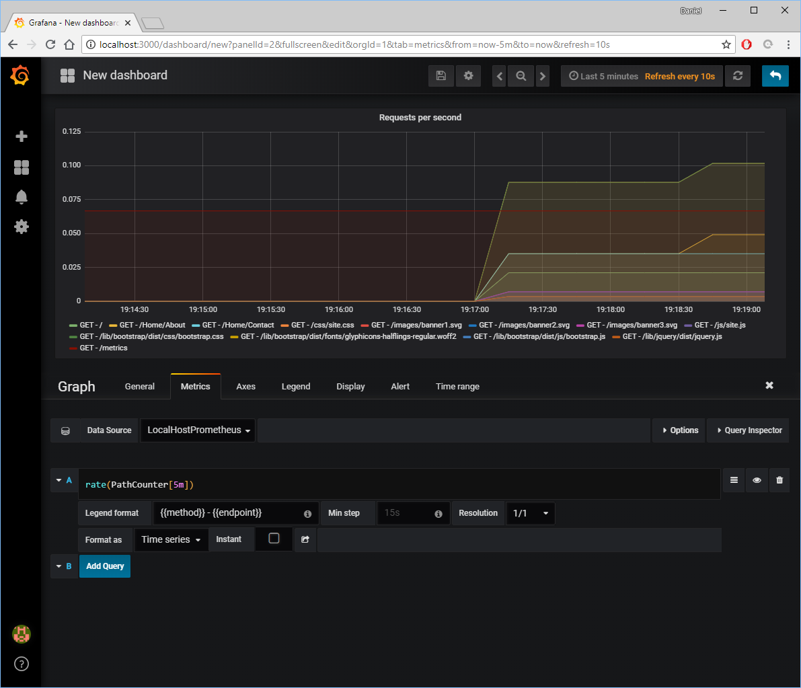
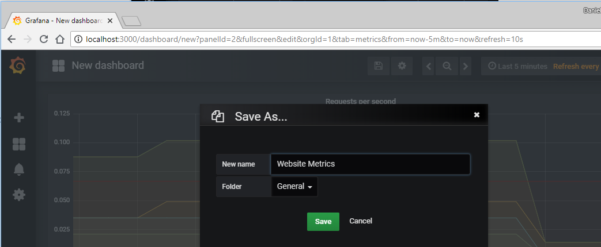
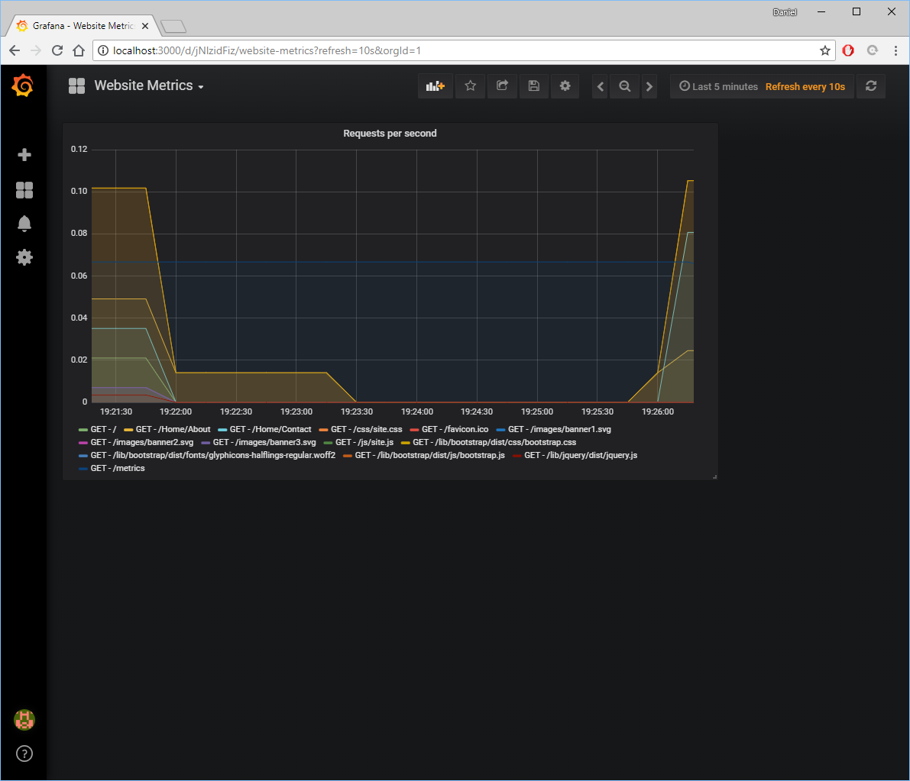

The first blog post for setting up Prometheus and adding a custom client library is [here][0].

As a quick reminder, the custom metrics I have is the count of API calls by Method and Endpoint.



## Grafana

Grafana is an excellent graphing data visualization platform.  Go ahead and download it from [here][1].

Start it with this command.

```powershell
.\grafana-server.exe web
```

<br/>

```powershell
PS C:\Users\Daniel\Downloads\grafana-5.2.1.windows-amd64\grafana-5.2.1\bin> .\grafana-server.exe web
...
...
...
INFO[07-24|19:04:18] Initializing SearchService               logger=server
INFO[07-24|19:04:18] Initializing PluginManager               logger=server
INFO[07-24|19:04:18] Starting plugin search                   logger=plugins
INFO[07-24|19:04:18] Plugin dir created                       logger=plugins dir=C:\\Users\\Daniel\\Downloads\\grafana-5.2.1.windows-amd64\\grafana-5.2.1\\data\\plugins
INFO[07-24|19:04:18] Initializing InternalMetricsService      logger=server
INFO[07-24|19:04:18] Initializing AlertingService             logger=server
INFO[07-24|19:04:18] Initializing HTTPServer                  logger=server
INFO[07-24|19:04:18] Initializing CleanUpService              logger=server
INFO[07-24|19:04:18] Initializing NotificationService         logger=server
INFO[07-24|19:04:18] Initializing ProvisioningService         logger=server
INFO[07-24|19:04:18] Initializing RenderingService            logger=server
INFO[07-24|19:04:18] Initializing TracingService              logger=server
INFO[07-24|19:04:18] Initializing Stream Manager
INFO[07-24|19:04:18] HTTP Server Listen                       logger=http.server address=0.0.0.0:3000 protocol=http subUrl= socket=
```

The default username and password is "admin" and "admin".  The url is http://localhost:3000/login.  On first login, you might be prompted to change password.



On first login, there won't be anything to show.



Go ahead and click on that "Add data source". But make sure that Prometheus is running on the local machine.

Fill out Grafana Data source as shown below to add a localhost Prometheus, then "Save &d Test".



Choose "New Dashboard" from the side button.



Let's create a new graph panel.





Fill out the textboxes with below. Also, make sure to do whatever needed to generate custom metrics.

* Formula: _rate(PathCounter[5m])_
* Legend Format: _{{method}} - {{endpoint}}_



On the top, there's a "Save button" icon. Click



Congratulations!  The dashboard now has a fancy graph showing data in real-time.



## Summary

Add dashboards, add panels, add visualizations. Customize the view of data however you need to. Make the data actionable and valuable for your boss, for your team, and for you. Data visualization without meaning is just white noise.

[0]: /2018-07-22-prometheus-dotnetcore
[1]: https://grafana.com/grafana/download
