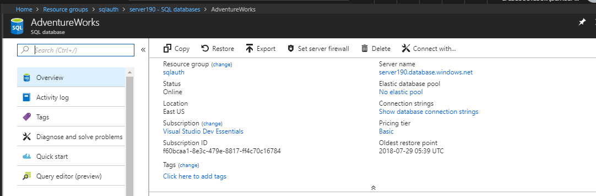
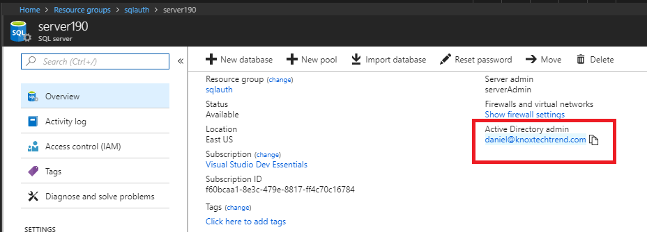
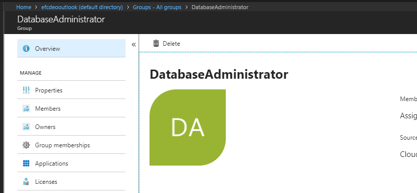
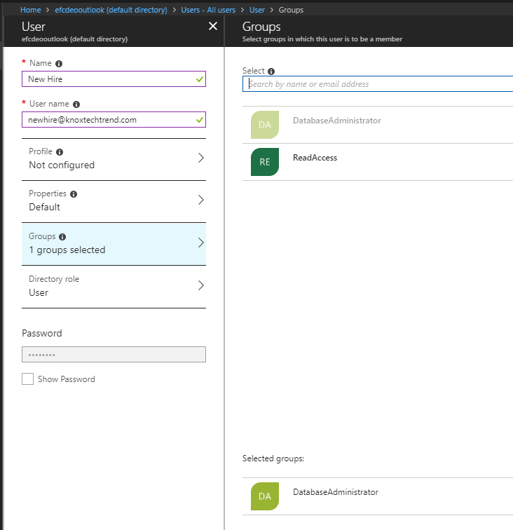
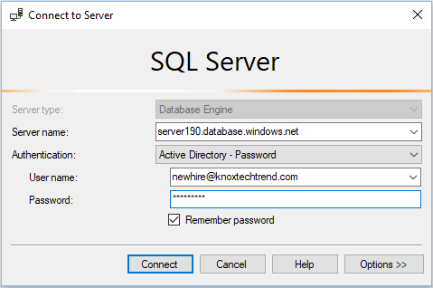
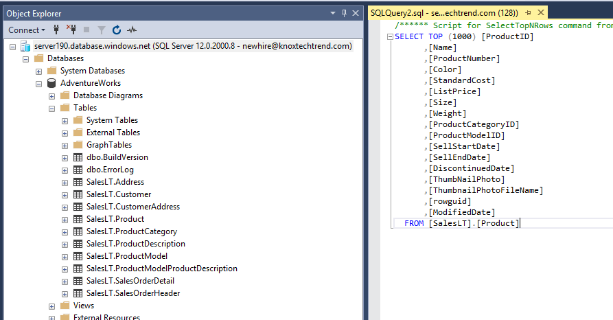

I have several Azure SQL databases and I'd like to make managing authentication with them easier.  For this blog post I've spun up a sample database using the AdventureWorks sample available.



## Azure Active Directory Admin

The first step is making sure that an Azure Active Directory Admin is the SQL Database Admin



### Group

I also have a group in Active Directory that I've titled "DatabaseAdministrator" that I intend to grant permissions to.



## SQL Server Add Role

Using the Azure Active Directory Admin, I'm going to login and run two commands on the database. This can either be run with SQL Server Management Studio or automated as part of database creation script with [sqlcmd][4].

```sql
CREATE USER [DatabaseAdministrator] FROM EXTERNAL PROVIDER;
EXEC sp_addrolemember 'db_datareader', 'DatabaseAdministrator';
```

<br/>

A database administrator should probably have more access than just "db_datareader", but that's good enough to start with.

## Add User

The day has finally come where a new database administrator has been hired.  Let's set them up in Azure Active Directory with the group _DatabaseAdministrator_.



## New Hire login

Let's get the new hire to login.



They should automatically have access to read data.



## Summary

Letting Active Directory manage authentication for users is a much better option than trying to create a selection of service accounts for each administrator. Automatically granting access to databases based upon user role and job title, is even better.

### References

* [Lessons learned][1].
* [Manage Logins][0].
* [Active Directory Authentication][2].

[0]: https://docs.microsoft.com/en-us/azure/sql-database/sql-database-manage-logins
[1]: https://blogs.msdn.microsoft.com/azuresqldbsupport/2017/03/10/lesson-learned-23-how-to-add-aad-security-groups-to-azure-sql-database/
[2]: https://docs.microsoft.com/en-us/azure/sql-database/sql-database-aad-authentication-configure
[3]: https://docs.microsoft.com/en-us/sql/relational-databases/security/authentication-access/server-level-roles?view=sql-server-2017
[4]: https://docs.microsoft.com/en-us/sql/tools/sqlcmd-utility?view=sql-server-2017
