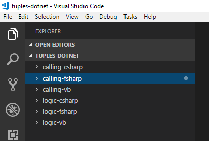

Tuples in .NET are a very welcome feature. This is how each of the three main .NET languages may call each other with tuples. Note that I'm making it more complicated than need be with some nullable parameters.

## New Project Setup

As usual, I like to give context by demonstrating how I setup my projects from scratch.

```powershell
> dotnet --version
2.1.302
> mkdir tuples-dotnet
> cd tuples-dotnet

> dotnet new console -lang c# -o calling-csharp
> dotnet new console -lang f# -o calling-fsharp
> dotnet new console -lang vb -o calling-vb

> dotnet new classlib -lang vb -o logic-vb
> dotnet new classlib -lang c# -o logic-csharp
> dotnet new classlib -lang f# -o logic-fsharp

> dotnet add .\calling-csharp\ reference .\logic-csharp\
> dotnet add .\calling-csharp\ reference .\logic-fsharp\
> dotnet add .\calling-csharp\ reference .\logic-vb\

> dotnet add .\calling-fsharp\ reference .\logic-csharp\
> dotnet add .\calling-fsharp\ reference .\logic-fsharp\
> dotnet add .\calling-fsharp\ reference .\logic-vb\

> dotnet add .\calling-vb\ reference .\logic-csharp\
> dotnet add .\calling-vb\ reference .\logic-fsharp\
> dotnet add .\calling-vb\ reference .\logic-vb\

> dotnet add .\calling-csharp\ package fsharp.core
> dotnet add .\calling-vb\ package fsharp.core
```

I'm not creating any new files. I'm editing the generated files in-place.



## VB Logic

```basic
Public Class Class1

    Public Shared Function FormatText(ByVal greeting as String, ByVal extraParameters as Nullable(Of (name as String, ageYears as Integer))) as String
        If extraParameters Is Nothing Then
            Return greeting
        Else If extraParameters?.ageYears < 0 Then
            Return $"{greeting}. It seems unlikely that {extraParameters?.name} is {extraParameters?.ageYears} years old. Are they from the future?"
        Else
            Return $"{greeting}. {extraParameters?.name} is {extraParameters?.ageYears} years old."
        End If
    End Function

End Class
```

## C# Logic

```csharp
using System;

namespace logic_csharp
{
    public class Class1
    {
        public static string FormatText(string greeting, (string name, int ageYears)? extraParameters)
        {
            if(extraParameters == null) {
                return greeting;
            } else if(extraParameters?.ageYears < 0) {
                return $"{greeting}. It seems unlikely that {extraParameters?.name} is {extraParameters?.ageYears} years old. Are they from the future?";
            } else {
                return $"{greeting}. {extraParameters?.name} is {extraParameters?.ageYears} years old.";
            }
        }
    }
}
```

## F# Logic

```fsharp
namespace logic_fsharp

module Say =
    let FormatText (greeting: string) (extraParameters: (string * int) option): string =
        match extraParameters with
        | None -> greeting
        | Some (name, ageYears) ->
            if ageYears < 0 then
                sprintf "%s. It seems unlikely that %s is %i years old. Are they from the future?" greeting name ageYears
            else
                sprintf "%s. %s is %i years old." greeting name ageYears
```

## VB.NET Console

```basic
Imports System

Module Program
    Sub Main(args As String())
        Console.WriteLine(logic_csharp.Class1.FormatText("C# called from VB.NET", ("Daniel", -5)))

        Console.WriteLine(logic_vb.Class1.FormatText("VB.NET called from VB.NET", ("Daniel", 5)))

        Dim fsharp_extraParameters = new Microsoft.FSharp.Core.FSharpOption(Of Tuple(Of String, Integer)) (new Tuple(Of String, Integer)("Daniel", 5))
        Console.WriteLine(logic_fsharp.Say.FormatText("F# called from VB.NET", fsharp_extraParameters))
    End Sub
End Module
```

<br/>

```
PS C:\Users\Daniel\Development\tuples-dotnet\calling-vb> dotnet run
C# called from VB.NET. It seems unlikely that Daniel is -5 years old. Are they from the future?
VB.NET called from VB.NET. Daniel is 5 years old.
F# called from VB.NET. Daniel is 5 years old.
```

## C# Console

```csharp
using System;

namespace calling_csharp
{
    class Program
    {
        static void Main(string[] args)
        {
            Console.WriteLine(logic_csharp.Class1.FormatText("C# called from C#", ("Daniel", -5)));

            Console.WriteLine(logic_vb.Class1.FormatText("VB.NET called from C#", ("Daniel", 5)));

            var fsharp_extraParameters = new Microsoft.FSharp.Core.FSharpOption<System.Tuple<string, int>>(new System.Tuple<string, int>("Daniel", 5));
            Console.WriteLine(logic_fsharp.Say.FormatText("F# called from C#", fsharp_extraParameters));
        }
    }
}
```

<br/>

```
PS C:\Users\Daniel\Development\tuples-dotnet\calling-csharp> dotnet run
C# called from C#. It seems unlikely that Daniel is -5 years old. Are they from the future?
VB.NET called from C#. Daniel is 5 years old.
F# called from C#. Daniel is 5 years old.
```

## F# Console

```fsharp
open System

[<EntryPoint>]
let main argv =
    // Console.WriteLine(logic_csharp.Class1.FormatText("C# called from F#", System.Nullable(struct("Daniel", -5))))

    // Console.WriteLine(logic_vb.Class1.FormatText("VB.NET called from F#", System.Nullable(struct("Daniel", -5))))

    Console.WriteLine(logic_fsharp.Say.FormatText "F# called from F#" (Option.Some("Daniel", 5)))

    0 // return an integer exit code
```

Interestingly, this is where I had problems passing in a value of the below type to both C# and VB.NET.  A quick google suggests [this workaround][0], but I couldn't quite get it working.

> string * Nullable<struct(string * int)> -> string

```
PS C:\Users\Daniel\Development\tuples-dotnet\calling-fsharp> dotnet run
F# called from F#. Daniel is 5 years old.
```

## Summary

Go ahead and use tuples in any of the .NET languages, just consider carefully before using them as nullable parameters to methods.

[0]: https://github.com/Microsoft/visualfsharp/issues/5217
